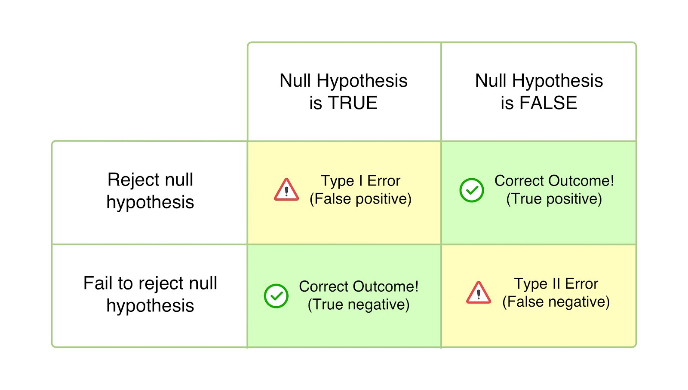

Today:
- Extending linear models beyond just least squares regressions

Let’s talk about the three most common methods for feature selection!

**Subset Selection:** We identify a subset of the p predictors that we believe to be related to the response. We then fit a model using least squares on the reduced set of variables
**Shrinkage:** We fit a model involving all p predictors, but the estimated coefficients are shrunken towards zero relative to the least squares estimates. This shrinkage (also known as regularization) has the effect of reducing variance and can also perform variable selection.
**Dimension Reduction:** We project the p predictors into a M-dimensional subspace, where M < p. This is achieved by computing M different linear combinations, or projections, of the variables. Then these M projections are used as predictors to fit a linear regression model by least squares. (don’t let this sound too scary!)



```{r setup, include=FALSE}
# ┏━━━┓╋╋┏┓┏┓╋╋╋╋╋╋╋╋╋╋╋╋╋╋┏━┓╋┏┓┏┓╋╋╋╋╋┏━━━┓┏┓┏┓╋╋╋╋╋╋┏┓
# ┃┏━┓┃╋╋┃┃┃┃╋╋╋╋╋╋╋╋╋╋╋╋╋╋┃┏┛┏┛┗┫┃╋╋╋╋╋┃┏━┓┣┛┗┫┃╋╋╋╋╋┏┛┗┓
# ┃┃╋┗╋━━┫┃┃┃┏━━┳━━┳━━┓┏━━┳┛┗┓┗┓┏┫┗━┳━━┓┃┃╋┃┣┓┏┫┃┏━━┳━╋┓┏╋┳━━┓
# ┃┃╋┏┫┏┓┃┃┃┃┃┃━┫┏┓┃┃━┫┃┏┓┣┓┏┛╋┃┃┃┏┓┃┃━┫┃┗━┛┃┃┃┃┃┃┏┓┃┏┓┫┃┣┫┏━┛
# ┃┗━┛┃┗┛┃┗┫┗┫┃━┫┗┛┃┃━┫┃┗┛┃┃┃╋╋┃┗┫┃┃┃┃━┫┃┏━┓┃┃┗┫┗┫┏┓┃┃┃┃┗┫┃┗━┓
# ┗━━━┻━━┻━┻━┻━━┻━┓┣━━┛┗━━┛┗┛╋╋┗━┻┛┗┻━━┛┗┛╋┗┛┗━┻━┻┛┗┻┛┗┻━┻┻━━┛
# ╋╋╋╋╋╋╋╋╋╋╋╋╋╋┏━┛┃
# ╋╋╋╋╋╋╋╋╋╋╋╋╋╋┗━━┛       Applied Data Science II - Week 3
# # ---------------------------------------------------------------
knitr::opts_chunk$set(echo = TRUE)

library(leaps) 
library(ISLR2)
library(tidyverse)
library(glmnet)
library(pls)

# do these not work? Then you'll have to install them! 

# Uncomment the line below and run this command: 
# install.packages(c("leaps","glmnet","tidyverse","pls"))
```

```{r}
# # ---------------------------------------------------------------
#
# Best Subset Selection 
#
# # ---------------------------------------------------------------

# Best Subset Selection

# Let's take a peek at a new dataset about baseball called Hitters! 

data(Hitters)

Hitters

names(Hitters)

dim(Hitters)

sum(is.na(Hitters$Salary))

# NAs can be bad for modeling purposes, so let's drop all the rows that contain NAs! 

Hitters_dropNA <- na.omit(Hitters)

dim(Hitters_dropNA)

sum(is.na(Hitters_dropNA))

# Let's perform a regular subsets regression using the 
# regsubsets() function.
# When in doubt, remember: ??regsubsets

regfit.full <- regsubsets(Salary ~ ., Hitters_dropNA)
?regsubsets # a function for linear model selection (stepwise or sequential)

summary(regfit.full) # for each iteration of the search (shows you the top 8), which variables were kept in the model selection?

# Note that since we didn't select a value for the method parameter, it defaulted
# to exhaustive (i.e., full best subsets selection) vs. forward or backwards.
# An asterisk indicates that a given variable is included in the corresponding
# model. For instance, this output indicates that the best two-variable model
# contains only Hits and CRBI. By default, regsubsets() only reports results
# up to the best eight-variable model. But the nvmax option can be used
# in order to return as many variables as are desired. 

# Now let's fit a full 19-variable model.

regfit.full <- regsubsets(Salary ~ ., data = Hitters_dropNA,
                          nvmax = 19)

reg.summary <- summary(regfit.full)
reg.summary

# The summary() function also returns R2, RSS, adjusted R2, Cp, and BIC.
# We can examine these to try to select the best overall model.

names(reg.summary)

# We know, from the readings!, that R2 should always increase for each new variable. Let's look.

reg.summary$rsq # get the R2 values

# Let's plot the RSS and the Adjusted R2! We'll use ggplot since y'all are more comfortable there

plot_metrics <- data.frame(rss = reg.summary$rss, adjr2 = reg.summary$adjr2, numvar = 1:19)

plot_metrics %>% 
        ggplot(aes(y = rss, x = numvar)) + 
        geom_point() + 
        geom_line() + 
        xlab("Number of Variables") + ylab("RSS") + 
        theme_bw() + 
        ggtitle("RSS for addition of each variable")

plot_metrics %>% 
        ggplot(aes(y = adjr2, x = numvar)) + 
        geom_point() + 
        geom_line() + 
        xlab("Number of Variables") + ylab("Adjusted R2") + 
        theme_bw() + 
        ggtitle("Adjusted R2 for addition of each variable")

# We could also manually find which variable count has the best Adjusted R2
which.max(reg.summary$adjr2)

# Or, if we're in a hurry - we can just use the native plot implementation!
# You'll note these plots look MUCH different than what you'd expect - that's because the regsubsets
# method imports a new form of plot() call!
plot(regfit.full, scale = "r2") # see the best models for R2 (at the top row of the plot)
plot(regfit.full, scale = "adjr2") # same for adjusted R2
plot(regfit.full, scale = "Cp") # same for Cp
plot(regfit.full, scale = "bic") # same for BIC (more conservative)

# Notice how that BIC plot is a little different, and only contains six variables? If you'd like to peek
# at those variables, you can just use the coef() function! 

coef(regfit.full, 6)
summary(lm(data = Hitters_dropNA, Salary ~ AtBat + Hits + Walks + CRBI + Division + PutOuts))
```

```{r}
# # ---------------------------------------------------------------
#
# Forward and Backward Selection
#
# # ---------------------------------------------------------------

# Let's do this forward! 
regfit.fwd <- regsubsets(Salary ~ ., data = Hitters,
                         nvmax = 19, method = "forward")
summary(regfit.fwd)

# Now backwards! 
regfit.bwd <- regsubsets(Salary ~ ., data = Hitters,
                         nvmax = 19, method = "backward")
summary(regfit.bwd)

# For instance, we see that using forward stepwise selection, the best one variable model contains only CRBI, 
# and the best two-variable model additionally includes Hits. For this data, the best one-variable through 
# six variable models are each identical for best subset and forward selection.
# However, the best seven-variable models identified by forward stepwise selection, 
# backward stepwise selection, and best subset selection are different. See below! 

# Now compare them! 
coef(regfit.full, 7)
coef(regfit.fwd, 7)
coef(regfit.bwd, 7)

# # ---------------------------------------------------------------
#
# STOP! Your turn! 
#
# Load the data called Credit from the ISLR library with: data("Credit).
# 
# Run a FORWARD subsets selection algorithm for all the variables
# (using Rating as the dependent variable)
# and tell me the optimal number of variables to include is (using BIC)
# and report the BIC value. 
#
# # ---------------------------------------------------------------

data(Credit)
Credit

Credit <- na.omit(Credit)

regfit.fwd <- regsubsets(Rating ~ ., data = Credit,
                         nvmax = 19, method = "forward")
summary(regfit.fwd)

reg.summary <- summary(regfit.fwd)
reg.summary

plot_metrics <- data.frame(bic = reg.summary$bic, numvar = 1:11)
plot_metrics

plot_metrics %>% 
        ggplot(aes(y = bic, x = numvar)) + 
        geom_point() + 
        geom_line() + 
        xlab("Number of Variables") + ylab("BIC") + 
        theme_bw() + 
        ggtitle("BIC for addition of each variable")

plot(regfit.fwd, scale = "bic")

which.min(reg.summary$bic)
reg.summary$bic[2]
```

```{r}
# # ---------------------------------------------------------------
#
# Ridge Regression 
#
# # ---------------------------------------------------------------

# Let's once again use the Hitters data. 

# We will use the glmnet package in order to perform ridge regression and
# the lasso. The main function in this package is glmnet(), which can use 
# glmnet() to fit ridge regression models, lasso models, and more. This function has
# slightly different syntax from other model-fitting functions that we have
# encountered thus far. In particular, we must pass in an x
# matrix as well as a y vector, and we do not use the y ~ x syntax. We will
# now perform ridge regression and the lasso in order to predict Salary on
# the Hitters data. Before proceeding ensure that the missing values have
# been removed from the data (which we've already done above!)

x <- model.matrix(Salary ~ ., Hitters_dropNA)[, -1] # x is a matrix of the data set, minus the salary column
y <- Hitters_dropNA$Salary # y is the vector of salary values

# Let's look at x

x

# Let's perform the Ridge regression! 

grid <- 10^seq(10, -2, length = 100)
# We need to build a grid of values for lambda to test. Remember: the value of lambda
# is extremely important to the outcome of the actual ridge regression, so we need to test a lot
# of different values to find the best one. 
# By default the glmnet() function performs ridge regression for an automatically selected range of 
# lambda values. 

ridge.mod <- glmnet(x, y, alpha = 0, lambda = grid)

# The glmnet() function has an alpha argument that determines what type
# of model is fit. If alpha=0 then a ridge regression model is fit, and if alpha=1
# then a lasso model is fit. We first fit a ridge regression model.
# It's also worth noting that glmnet() automatically standardizes the variables. 
# ... do you remember what that means? 

# Let's check out our outputs! 

summary(ridge.mod)

# woah...not what you were expecting, huh? 

# Let's peek at the dimensions of the coefficients
dim(coef(ridge.mod))

# Why do you think there is a 20 x 100 matrix of coefficient outputs? 

coef(ridge.mod)

# Let's look at a random lambda 
ridge.mod$lambda[50]

# okay, so what do the coefficients look like for a lambda of 11497.57?

coef(ridge.mod)[, 50]
```

```{r}
# What do you think you will see with a significantly smaller value of lambda? 

ridge.mod$lambda[60]

coef(ridge.mod)[, 60]

# Note the much larger l2 norm of the coefficients associated with this
# significantlly smaller value of lambda.
```

```{r}
# Now, let's get to actually seeing how this can work for predictive purposes! 

# Set your seed to make this common between all of us.
set.seed(1)

# Moving forward, you'll often need to set a "Training" and "testing" group from your data
# In order to calculate various kinds of predictive accuracy metrics. This is a great way to do so
# below. 

train <- sample(1:nrow(x), nrow(x) / 2)
test <- (-train)
y.test <- y[test]

# Next we fit a ridge regression model on the training set, and evaluate
# its MSE on the test set, using a lambda = 4. Note the use of the predict()
# function This time we get predictions for a test set, by replacing
# type="coefficients" with the newx argument.

# Run ridge regression on TRAINING data
ridge.mod <- glmnet(x[train, ], y[train], alpha = 0,
                    lambda = grid, thresh = 1e-12)

# PREDICT outputs of the ridge regression using the TEST data
ridge.pred <- predict(ridge.mod, s = 4, newx = x[test, ])
ridge.pred
```

```{r}
# Calculate MSE! 
mean((ridge.pred - y.test)^2)
```

```{r}
# Let's compare that to the predictions of an LM model! 

lm.model <- lm(y~x, subset = train)
lm.pred <- predict(lm.model, newx = x[test,], type = "response")

# Calculate MSE! 
mean((lm.pred - y.test)^2)

# Ridge is waaaaay better. 

# A neat trick to remember: a least squares  estimate is simply
# a ridge regression with the lambda set to 0. For this part, we'll set our predictions to output
# coefficient estimates vs. raw dependent predictions. This way we'll see how a ridge regression with a
# lambda of 0 is basically equivalent to an LM model. 

lm(y~x, subset = train)

predict(ridge.mod, s=0, type="coefficients")[1:20,]

# Pretty darn close!
```

```{r}
# But what if we wanted to have this done automatically for us, this whole "choose lambda" nonsense?
# We can use the power of cross-validation! 
# Don't know what that is? That's okay! We're gonna talk about it in Week 5, but I wanted you to take a peek
# at it now to get an idea of how it works. 

set.seed(1)
cv.out<-cv.glmnet(x[train, ], y[train], alpha=0)

plot(cv.out)

# Let's extract that best lambda value 
bestlam<-cv.out$lambda.min

# And plug it in to our previous MSE calculator:
ridge.pred.2 <- predict(ridge.mod, s=bestlam, newx=x[test,])
mean((ridge.pred.2-y.test)^2)

# Is this better than our previous one? 
mean((ridge.pred - y.test)^2)
```

```{r}
# # ---------------------------------------------------------------
#
# Lasso Regression 
#
# # ---------------------------------------------------------------

# This will look pretty familiar, just change alpha = 1! 

lasso.mod <- glmnet(x[train, ], y[train], alpha = 1,
                    lambda = grid)

# Let's see how close the MSE values are between Lasso and Ridge 

set.seed(1)
cv.out <- cv.glmnet(x[train, ], y[train], alpha = 1)
bestlam_lasso <- cv.out$lambda.min
lasso.pred <- predict(lasso.mod, s = bestlam_lasso,
                      newx = x[test, ])
mean((lasso.pred - y.test)^2)
mean((ridge.pred - y.test)^2)

# Basically the same, although the ridge regression one is slightly lower (but not meaningfuly so). 

# The real power here is comparing the model interpretability! 
# Let's look at the coefficient estimates for the lasso model. 

out_lasso <- glmnet(x, y, alpha = 1, lambda = grid)
lasso.coef <- predict(out_lasso, type = "coefficients",
                      s = bestlam_lasso)[1:20, ]
lasso.coef

# Compare this to the Ridge model. 
out_ridge <- glmnet(x, y, alpha = 0, lambda = grid)
ridge.coef <- predict(out_ridge, type = "coefficients", s = bestlam)[1:20,]

ridge.coef

# # ---------------------------------------------------------------
#
# STOP! Your turn! 
#
# Use the credit data to run a Ridge model. Use Rating as your dependent
# variable again. Calculate the test MSE. 
# 
#
# # ---------------------------------------------------------------
```

```{r}
# # ---------------------------------------------------------------
#
# PCR Regression! 
#
# # ---------------------------------------------------------------

# Principal components regression (PCR) can be performed using the pcr() pcr() function,
# which is part of the pls library. We now apply PCR to the Hitters
# data, in order to predict Salary. 

set.seed(2)
# The syntax for the pcr() function is similar to that for lm(), with a few
# additional options. Setting scale = TRUE has the effect of standardizing each
# predictor,  prior to generating the principal components, so that
# the scale on which each variable is measured will not have an effect. Setting
# validation = "CV" causes pcr() to compute the ten-fold cross-validation
# error for each possible value of M, the number of principal components
# used. AGain, don't worry if that makes no sense yet - we'll talk about that soon!
# The resulting fit can be examined using summary().
pcr.fit <- pcr(Salary ~ ., data = Hitters_dropNA, scale = TRUE,
               validation = "CV")

summary(pcr.fit)

###
validationplot(pcr.fit, val.type = "MSEP")
###
set.seed(1)
pcr.fit <- pcr(Salary ~ ., data = Hitters, subset = train,
               scale = TRUE, validation = "CV")

validationplot(pcr.fit, val.type = "MSEP")
###
pcr.pred <- predict(pcr.fit, x[test, ], ncomp = 5)
mean((pcr.pred - y.test)^2)
###
pcr.fit <- pcr(y ~ x, scale = TRUE, ncomp = 5)
summary(pcr.fit)
```

```{r}
# # ---------------------------------------------------------------
#
# PLS Regression! 
#
# # ---------------------------------------------------------------

#We implement partial least squares (PLS) using the plsr() function, also plsr() in the pls library. 
# The syntax is just like that of the pcr() function
set.seed(1)
pls.fit <- plsr(Salary ~ ., data = Hitters_dropNA, subset = train, scale = TRUE, validation = "CV")
summary(pls.fit)
validationplot(pls.fit, val.type = "MSEP")
# The lowest cross-validation error occurs when only M = 1 partial least
#squares directions are used. We now evaluate the corresponding test set
# MSE.


pls.pred <- predict(pls.fit, x[test, ], ncomp = 1)
mean((pls.pred - y.test)^2)

# The test MSE is comparable to, but slightly higher than, the test MSE
# obtained using ridge regression, the lasso, and PCR.
# Finally, we perform PLS using the full data set, using M = 1, the number
# of components identified by cross-validation.

pls.fit <- plsr(Salary ~ ., data = Hitters, scale = TRUE,
                ncomp = 1)
summary(pls.fit)

# Notice that the percentage of variance in Salary that the one-component
# PLS fit explains, 43.05 %, is almost as much as that explained using the final
# five-component model PCR fit, 44.90 %. This is because PCR only attempts
# to maximize the amount of variance explained in the predictors, while PLS
# searches for directions that explain variance in both the predictors and the
# response.
```

