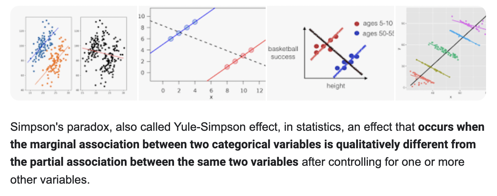

Today: SPLINES AND GAMS!! 

Note: The standard training data to testing data ratio is 70% to 30%.
Note: The central limit theorem states that the average of averages in a data set tends to be normally distributed.

```{r}
# Applied Data Science II - Week 6
# # ---------------------------------------------------------------

# Today we are going to talk about SPLINES and GAMS! 
#
#
# # ---------------------------------------------------------------
#
# Load your libraries! 
#
# # ---------------------------------------------------------------

library(ISLR2)
library(tidyverse)
library(caret)
library(splines)
library(npreg)
library(mgcv)
library(PerformanceAnalytics)

```

```{r}
# # ---------------------------------------------------------------
#
# Splines!
# 
# # ---------------------------------------------------------------

# Let's start by checking out the Wage dataset. It's not very fancy, but it's useful for teaching!
# This dataset is just wages and other data for a group of 3000 male workers in the Mid-Atlantic region.

attach(Wage)
head(Wage)

# Let's take a look at a plot between wages and age...

Wage %>% 
        ggplot(aes(x = age, y = wage)) + 
        geom_point() + 
        theme_bw()

# It's got some pretty funky behavior, right? If we add a linear model to it, we can see it's not going to
# fit really well ...

Wage %>% 
        ggplot(aes(x = age, y = wage)) + 
        geom_point() + 
        theme_bw() + 
        geom_smooth(method = "lm", color = "red")

# We can also just run the math and see that the fit probably won't be great: 

summary(lm(wage ~ age, data = Wage))

# Yep, not super great.
```

```{r}
# So since we suspect some nonlinearity here, we can use a spline! 
# To use a spline is straightforward - you can call the bs() function (from the spline library)
# and this lets you manually add in "knots" to your spline regression! 

spline_regression <- lm(wage ~ bs(age, knots = c(25, 40, 60)), data = Wage) 
# the bs() function changes everything, it stands for B-spline analysis
# the knots parameter is the position of the knots we would like to see

# for information on the relationship between the number of knots and the degrees of freedom, see the textbook reading: ISLR2, ISLR: 7.1, 7.4, 7.5, 7.7.

# and, as we can see - the fit is better! 
summary(spline_regression)

# we can also visualize it! 

Wage %>% 
        ggplot(aes(x = age, y = wage)) + 
        geom_point() + 
        theme_bw() + 
        geom_smooth(method = "lm", color = "red", 
                    formula = y ~ bs(x, knots = c(25, 40, 60)))

# note the somewhat funky way you have to pass these arguments into ggplot2!
```

```{r}
# now, in the above, we SPECIFIED where to put the knots. We can achieve a similar result
# by letting R choose for us! 

# Let's show that these produce a vector with the same dimensions...

dim(bs(age, knots = c(25, 40, 60)))
dim(bs(age, df = 6))

# why 6?
# This df command produces a spline with six basis functions. 
# This is because the bs() function naturally produces a  a cubic spline which, when it has
# three knots, has seven degrees of freedom; six basis functions + one intercept. 

# HOWEVER MANY KNOTS YOU WOULD LIKE IS: 2*knots = number of degrees of freedom.

attr(bs(age, df = 6), "knots")

# If we just let R choose...

summary(lm(wage ~ bs(age, df = 6), data = Wage))

# slightly better! does it look all that different? 

Wage %>% 
        ggplot(aes(x = age, y = wage)) + 
        geom_point() + 
        theme_bw() + 
        geom_smooth(method = "lm", color = "red", 
                    formula = y ~ bs(x, knots = c(25, 40, 60))) + 
        geom_smooth(method = lm, color = "blue", 
                    formula = y ~ bs(x, df = 6))
```

```{r}
# nah. 

# Want to fit a spline of ANY degree (and not just a cubic one?) Use the NS function! This uses
# "natural" splines which are even more flexible:

summary(lm(wage ~ ns(age, df = 12), data = Wage))

Wage %>% 
        ggplot(aes(x = age, y = wage)) + 
        geom_point() + 
        theme_bw() + 
        geom_smooth(method = "lm", color = "red", 
                    formula = y ~ bs(x, knots = c(25, 40, 60))) + 
        geom_smooth(method = lm, color = "green", 
                    formula = y ~ ns(x, df = 12))
```

```{r}
# But why have any silly constraints at all! Let's just use a SMOOTHING spline. 
# Note: your textbook uses the smooth.spline function. We're going to use a different one
# from the npreg library as it gives you way more flexibility. 

smoooooooooth <- npreg::ss(age, wage, nknots = 16)
smoooooooooth
summary(smoooooooooth)
smoooooooooth$fit$knot

# and, lastly, let's let the ss function actually choose the number of knots for us
# through cross-validation! 

final_smooth <- npreg::ss(age, wage)
final_smooth
summary(final_smooth)
final_smooth$fit$knot
length(final_smooth$fi$knot)


# and let's see what this looks like...

pred <- predict(final_smooth, Wage$wage)

Wage %>% 
        ggplot(aes(x = age, y = wage)) + 
        geom_point() + 
        theme_bw() + 
        geom_smooth(aes(x=age, y=wage),method = "lm", color = "red", 
                    formula = y ~ bs(x, knots = c(25, 40, 60))) + 
        stat_smooth(method = "gam", formula = y ~ bs(x, k = 52), color = "purple")


# # ---------------------------------------------------------------
#
# Stop! Back to the lecture!
# 
# # ---------------------------------------------------------------
```

```{r}
# # ---------------------------------------------------------------
#
# Let's TALK ABOUT THEM GAMS 
# 
# # ---------------------------------------------------------------

# Go ahead and download the dataset called "pisa_data.csv" from the Google Drive. 

pisa_data <- read_csv("w6 data//pisa_data.csv")
head(pisa_data)

# This is a nifty little dataset we've put together for you based on education.
# The data set has been constructed using average Science scores by country from 
# the Programme for International Student Assessment (PISA) 2006, along with GNI per capita, 
# Educational Index, Health Index, and Human Development Index from UN data. 

# Drop nulls!

pisa_data <- pisa_data %>%
        na.omit()

# Let's peek at the data with the chart.Correlation function

chart.Correlation(pisa_data[,2:11], histogram = TRUE, method = "pearson")
```



```{r}
# okay, let's start simple and fit a linear model *first*. we're going to use the
# mgcv library to use the gam() function and not pass anything fancy in. Note that there are 
# LOTS of libraries that use GAMs, so it's probably good to specifcy WHICH library you want to use 
# with ::
# Let's try predicting the overal score based solely on income. 

pisa_lm_simple <- mgcv::gam(Overall ~ Income, data = pisa_data)
summary(pisa_lm_simple)

# okay, not terribly bad. The overal adjusted R2 isn't too shabby. Now let's try fitting
# a very straightforward GAM that takes advantage of splines.
```

```{r}
pisa_gam_simple <- gam(Overall ~ s(Income, bs="cr"), data = pisa_data)
# Note: We again use the gam function as before for basic model fitting, but now we are using 
# the s function within the formula to denote the smoothing spline terms. Within that function we 
# also specify the type of smooth, though a default is available. I chose bs = cr, denoting cubic 
# regression splines (how we started above!)

summary(pisa_gam_simple)

plot(pisa_gam_simple)
```

```{r}
# looks better! Now let's try multiple predictors - and this time, let's use a test and train
# approach to get a better idea of overall model performance. 

# start linear...

set.seed(12345)
index <- createDataPartition(pisa_data$Overall, p = .8, list=FALSE)
training_data <- pisa_data[ index,]
test_data  <- pisa_data[-index,]

pisa_lm_multivariate <-  mgcv::gam(Overall ~ Income + Edu + Health, data = training_data)
summary(pisa_lm_multivariate)

# ...get rmse! 

predictions_lm <- predict(pisa_lm_multivariate, test_data)
RMSE(predictions_lm, test_data$Overall)

# now let's go full GAMMMMMSSSSS
pisa_gam_multivariate <- gam(Overall ~ s(Income) + s(Edu) + s(Health), data = training_data)
summary(pisa_gam_multivariate)

predictions_gam <- predict(pisa_gam_multivariate, test_data)
RMSE(predictions_gam, test_data$Overall)

# want to see how each of these effects is being modeled? use plot!
plot(pisa_gam_multivariate)

# if you want it to be prettier, check out the visreg package!
```

```{r}
# # ---------------------------------------------------------------
#
# Data Project Time! 
# 
# # ---------------------------------------------------------------

# Go into the Drive and open the file "walmart.csv". 
# this is some data related to weekly store sales at a bunch of different walmart stores
# around the country.Your job is to use all the tools at your disposal (linear models,
# lasso models, ridge models, or GAMS) to try and have the BEST fitting model possible as based on 
# minimizing RMSE. 
# You are trying to predict the weekly_sales based on the data available to you. 
# good luck! 

walmart <- read_csv("w6 data/walmart.csv")
head(walmart)

walmart_cleaned <- walmart %>% 
        mutate(store = as.factor(store),
               holiday_flag = as.factor(holiday_flag),
               year = as.factor(lubridate::year(lubridate::dmy(date))),
               month = as.factor(lubridate::month(date))) %>%
        select(-c(date))


set.seed(12345)
index <- createDataPartition(walmart_cleaned$weekly_sales, p = .8, list=FALSE)
training_data <- walmart_cleaned[ index,]
test_data  <- walmart_cleaned[-index,]

walmart_model <- gam(weekly_sales ~ store + holiday_flag + 
                                     s(temperature) +  
                                     s(fuel_price) + s(cpi) + s(unemployment) + 
                                     year + month, data = training_data)
summary(walmart_model)

predictions_gam <- predict(walmart_model, test_data)
RMSE(predictions_gam, test_data$weekly_sales)

```
