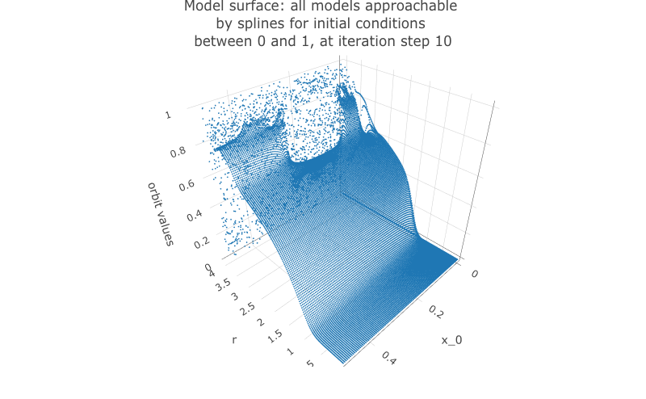

```{r setup, include=FALSE}
knitr::opts_chunk$set(echo = TRUE)

library(viridis)
library(ggthemes)
library(tidyverse)
library(plotly)
library(npreg)
library(splines)
library(caret)
library(Metrics)
library(mgcv)

clear_theme <- theme(legend.position="none",
                     panel.background = element_rect(fill="white"),
                     plot.margin=grid::unit(c(1,1,0,0), "mm"),
                     panel.grid=element_blank(),
                     axis.ticks=element_blank(),
                     axis.title=element_blank(),
                     axis.text=element_blank())
```

In this project, I will build nonlinear models using spline regressions, and a general additive model to predict the initial conditions of sets of points of the bifurcation diagram (final state diagram) of the logistic function $x_{n+1}=rx_n(1-x_n)$.

# The bifurcation diagram of the logistic equation

First, let's briefly explore the bifurcation diagram of the logistic equation, which we can plot using the code below: 

```{r}
logistic_eq <- function(x, r){return(r*x*(1-x))}

x <- seq(0, 4, length=500) # r scale
y <- c()

bifurcation_data <- function(r_values, x_0, min_iter=101, max_iter=300){
  for(r in r_values){
    new_y <- x_0
    orbit <- c()
    for(i in 0:max_iter){
      new_y <- logistic_eq(new_y, r)
      if(i <  min_iter){next}
      orbit <- c(orbit, new_y)
    }
    y <- c(y, tibble(orbit))
  }
  return(tibble(x_0=x_0, r=x, final_state=y, iter_num=rep(tibble(min_iter:max_iter), 
                                                          length(r_values))))
}
```

```{r}
x_0 <- 0.5

head(bifurcation_data(x, x_0))
bifurcation_data(x, x_0) %>% unnest(everything()) %>% ggplot(aes(r, final_state)) + 
  geom_point(size=0.01) + 
  labs(title=paste0("Bifurcation diagram of the logistic equation for x_0 = ", x_0)) +
  theme_tufte()
```

The bifurcation diagram of the logistic equation, (also known as a final state diagram), shows the orbits of the logistic function $x_{n+1}=rx_n(1-x_n)$ for values of $r$ between 0 and 1. The resolution of the plot/set is determined by the cardinality of the set of $r$ values used as the x axis, and the number of iterations computed by the `bifurcation_data()` function, plotted on the y axis. In the plot above, orbits were computed for 301 iterations, (iterations 0 to 300 as it is specified in the code), but the points corresponding to the first 101 iterations were skipped, resulting in a plot that ignores the beginning of the orbits. We could also choose to not skip iterates, which would result in a plot like the following:

**A plot of the bifurcation diagram points for x_0 = 0.5, with no iterates skipped:**

```{r}
bifurcation_data(x, x_0, 0, 300) %>% unnest(everything()) %>% ggplot(aes(r, final_state)) + 
  geom_point(size=0.01) + 
  labs(title=paste0("Bifurcation diagram of the logistic equation for x_0 = ", x_0)) +
  theme_tufte()
```

For ease of computation and interpretability, in this project I will first constitute a working data set from which to produce visualisations and models from low-resolution data sets of points on the bifurcation diagram of the logistic equation. The resolution in r values and in number of iterations will be `resolution`, and `resolution` respectively, with no iterates skipped. I have plotted an example below: 

**A plot of the lower resolution bifurcation diagram points for x_0 = 0.5:**

```{r}
resolution <- 10 # resolution, in number of units per dimension

x <- seq(0, 4, length=resolution) # r scale
bifurcation_data(x, x_0, 0, resolution-1) %>% unnest(everything()) %>% ggplot(aes(r, final_state)) + 
  geom_point(size=0.01) + 
  labs(title=paste0("Bifurcation diagram of the logistic equation for x_0 = ", x_0)) +
  theme_tufte()
```

## Data generation and formatting

Now that we're a bit more comfortable with bifurcation diagram of the logistic equation conceptually, let's collect the data we'll need to visualise variation of initial conditions, and from which we could build a model to predict the initial conditions used to generate a set of points using iterations of the logistic equations for values in the set of $r$ values `x`.

The following code will give us `resolution` r resolution by `resolution` iteration resolution point sets for `resolution` initial condition values between 0 and 1. Together, these variables form a $resolution^3$ resolution 3d space which that data will occupy.

We'll use a little higher resolution settings for our visualisations and data exploration: 

```{r}
resolution <- 60 # resolution, in number of units per dimension

x <- seq(0, 4, length=resolution) # r scale
min_iter <- 0; max_iter <- resolution-1
x_0s <- seq(0, 1, length=resolution)

data <- tibble()
for(x_0 in x_0s){
  data <- bind_rows(data, bifurcation_data(r=x, x_0, min_iter, max_iter))
}
```

Let's preview the data by peeking at the data tibble:

```{r}
head(data)
```

## Data exploration and visualisation

Let's also preview the data graphically altogether as a scatter plot:

```{r}
data %>% unnest(everything()) %>% 
  ggplot(aes(r, final_state, colour=x_0)) + 
  geom_point(size=0.01) + 
  scale_colour_gradientn(colours = rainbow(10)) + # + theme(legend.position = "none")
  theme_tufte()
```

The scatter plot gives us limited insight because values are stacked upon one another. But we can plot the x_0 axis in the third dimension, as a 3d point cloud, as below: 


Note that the structure produced by the point cloud in the plot above has symmetry along the `x_0` axis. This tells us that for any r value and iteration step, a function cannot approach the orbit values for an initial condition between 0 and 1, as there will be two initial conditions for which the orbits are identical.

However, all hope is not lost! The good news is that we can make a cheaper model that will work just as well! All we need to do is to cut the data set in half so as to contain only $x_0$ values above or below $0.5$ to obtain non-mirrored data for which the orbit coordinates for an iteration step and r value can be approached by a deterministic function.  

While we're at it, let's also visualise how the orbits gravitate towards a shape constituted of final states as the logistic equation is iterated: 


And let's observe how the initial condition $x_0$ affects the orbit values at different iterations:


Let's take slices of $x_0$ by final state at different iteration numbers values and have a look at the shapes they form. But first, let's generate higher resolution data to get nicer, more detailed plots.

```{r}
resolution <- 200 # resolution, in number of units per dimension
x <- seq(0, 4, length=resolution) # r scale
min_iter <- 0; max_iter <- 100
x_0s <- seq(0, 1, length=resolution)

data <- tibble()
for(x_0 in x_0s){
  data <- bind_rows(data, bifurcation_data(r=x, x_0, min_iter, max_iter))
}
```

Let's preview a few slices: 

```{r}
data %>% unnest(everything()) %>% filter(iter_num==iter_num[1]) %>% 
  ggplot(aes(x_0, final_state, alpha=r)) + geom_point(size=0.1) + 
  labs(title=paste0("Orbit value by initial condition for iterate ", 1),
       y="orbit values") +
  theme_tufte()

data %>% unnest(everything()) %>% filter(iter_num==iter_num[5]) %>% 
  ggplot(aes(x_0, final_state, alpha=r)) + geom_point(size=0.1) + 
  labs(title=paste0("Orbit value by initial condition for iterate ", 5),
       y="orbit values") +
  theme_tufte()

data %>% unnest(everything()) %>% filter(iter_num==iter_num[25]) %>% 
  ggplot(aes(x_0, final_state, alpha=r)) + geom_point(size=0.1) + 
  labs(title=paste0("Orbit value by initial condition for iterate ", 25),
       y="orbit values") +
  theme_tufte()

data %>% unnest(everything()) %>% filter(iter_num==iter_num[50]) %>% 
  ggplot(aes(x_0, final_state, alpha=r)) + geom_point(size=0.1) + 
  labs(title=paste0("Orbit value by initial condition for iterate ", 50),
       y="orbit values") +
  theme_tufte()

data %>% unnest(everything()) %>% filter(iter_num==iter_num[100]) %>% 
  ggplot(aes(x_0, final_state, alpha=r)) + geom_point(size=0.1) + 
  labs(title=paste0("Orbit value by initial condition for iterate ", 100),
       y="orbit values") +
  theme_tufte()
```
Optionally, you could save an image sequence for `iter_num` values

```{r}
# iter_num <- min_iter:max_iter
# for(i in iter_num){ # add in [1:10] when done with animation
#   plot <- data %>% unnest(everything()) %>% filter(iter_num==i) %>%
#     ggplot(aes(x_0, final_state, alpha=r/4)) +
#     geom_point(size=0.1) +
#     labs(title=paste0("Orbit value by initial condition for iterate ", i),
#          y = "orbit values") +
#     theme_tufte()
#   ggsave(paste0("image sequences/final state by initial condition by iterate line plot/", "orbit values by initial condition for iterate ", i, ".png"),
#          width=30, height=20, units="cm")
# }
```

The code above results in the following animation sequence: $\href{https://youtu.be/mmFu3PikEsc}{https://youtu.be/mmFu3PikEsc}$

Let's reset the resolution to our working resolution:

```{r}
resolution <- 60 # resolution, in number of units per dimension
x <- seq(0, 4, length=resolution) # r scale
min_iter <- 0; max_iter <- resolution-1
x_0s <- seq(0, 1, length=resolution)

data <- tibble()
for(x_0 in x_0s){
  data <- bind_rows(data, bifurcation_data(r=x, x_0, min_iter, max_iter))
}
```

Finally, let's observe how orbit values for different iteration steps and initial conditions form a 3d object with a fuzzy or spiky upper boundary in the $r$ dimension.


## Model-planning considerations

Now that we have a solid understanding of the shape of our data set, we can design a modelling approach. 

The goal is to predict the initial condition $x_0$ used to produce a bifurcation diagram. In other words, we are going to construct a model using `final_state` orbit values + `r` + `iter_num` to predict `x_0`.

I hypothesise that it will be easier to produce models with high predictive power and reliability for early iterations, and for $r$ values under 3, but that predictive power will tend to be harder to maintain for later iterations, or most values or $r$ above 3. 

We can confirm this hypothesis quite easily: Firstly, simply compare the orbit values for an initial condition at earlier iterations to those at later iterations. You will see that the earlier iterations result in distinct plots which overlap little and appear to be approachable by the curves of a function. Conversely, later iterations, such as those 55 and above plotted below appear less describable by curves due to their chaotic behaviour, and overlap exactly in the non-chaotic regions of the plot. 

```{r}
data %>% unnest(everything()) %>% 
  filter(iter_num<5) %>% filter(x_0==x_0s[25]) %>% 
  ggplot(aes(r, final_state, colour=as.factor(iter_num))) + 
  geom_line(aes(group=as.factor(iter_num))) +
  geom_point(alpha=0.4) +
  theme_tufte() +
  labs(title=paste0("Bifurcation diagram of the logistic map points \nfor x_0 = ", 
                    round(x_0s[25], 2)," and iterates [0 - 5)"), y="orbit values") +
  theme(legend.position = "none")

data %>% unnest(everything()) %>% 
  filter(iter_num>=55) %>% filter(x_0==x_0s[25]) %>% 
  ggplot(aes(r, final_state, colour=as.factor(iter_num))) + 
  geom_line(aes(group=as.factor(iter_num))) +
  geom_point(alpha=0.4) +
  theme_tufte() +
  labs(title=paste0("Bifurcation diagram of the logistic map points \nfor x_0 = ", 
                    round(x_0s[25], 2)," and iterates [55 - 60)"), y="orbit values") +
  theme(legend.position = "none")
```

We can also note that points where $r \geq 3$ are less approachable by curves. Comparing the following plots should help convey this behaviour more intiutively: 

```{r}
data %>% unnest(everything()) %>% 
  filter(r==x[15]) %>% 
  ggplot(aes(iter_num, final_state, colour=as.factor(x_0))) + 
  geom_line(aes(group=as.factor(x_0)), alpha=0.2) +
  labs(title=paste0("Orbits for different initial conditions, r = ", 
                    round(x[15], 3)), x="x_n", y="orbit values") + 
  theme_tufte() +
  theme(legend.position = "none")

data %>% unnest(everything()) %>% 
  filter(r==x[20]) %>% 
  ggplot(aes(iter_num, final_state, colour=as.factor(x_0))) + 
  geom_line(aes(group=as.factor(x_0)), alpha=0.2) +
  labs(title=paste0("Orbits for different initial conditions, r = ", 
                    round(x[20], 3)), x="x_n", y="orbit values") + 
  theme_tufte() +
  theme(legend.position = "none")

data %>% unnest(everything()) %>% 
  filter(r==x[59]) %>% 
  ggplot(aes(iter_num, final_state, colour=as.factor(x_0))) + 
  geom_line(aes(group=as.factor(x_0)), alpha=0.2) +
  labs(title=paste0("Orbits for different initial conditions, r = ", 
                    round(x[59], 3)), x="x_n", y="orbit values") + 
  theme_tufte() +
  theme(legend.position = "none")
```

## Model

We've seen from the data exploration above that we should build our model on a subset of the data composed of early iterates orbit values, at one value of R. 

```{r}
resolution <- 200 # resolution, in number of units per dimension
x <- seq(0, 4, length=resolution) # r scale
min_iter <- 0; max_iter <- resolution-1
x_0s <- seq(0, 1, length=resolution)

data <- tibble()
for(x_0 in x_0s){
  data <- bind_rows(data, bifurcation_data(r=x, x_0, min_iter, max_iter))
}
```

Let's start by selecting values to test our proof of concept.

```{r}
model_iterate_value <- 0
model_r_value <- x[round(resolution/2, 0)]
```

Now, let's split our data into training and testing sets.

```{r}
set.seed(1)

data_unnested <- data %>% unnest(everything()) %>% 
  filter(x_0 <= 0.5) %>% 
  filter(iter_num == model_iterate_value) %>% filter(r == model_r_value)

index <- createDataPartition(data_unnested$x_0, p = .8, list=FALSE)
training_data <- data_unnested[ index,]
test_data  <- data_unnested[-index,]
```

And let's create our training vectors from the training data set.

```{r}

x_0 <- training_data$x_0 
final_state <- training_data$final_state

IV <- final_state # predictor variables
DV <- x_0 # response variable
```

We're finally ready! Let's run a smooth spline regression on our training data, and test it on our test data set.

```{r}
# Let's try to perform a smooth spline regression:
final_smooth_model <- npreg::ss(DV, IV)
final_smooth_model
summary(final_smooth_model)
final_smooth_model$fit$knot
length(final_smooth_model$fi$knot)

pred <- predict(final_smooth_model, test_data$x_0)
print(paste("RMSE:", rmse(pred$y, test_data$x_0)))

test_data %>% 
        ggplot(aes(x = final_state, y = x_0)) + 
        stat_smooth(method = "gam", formula = y ~ bs(x, k = 50), color = "springgreen3") +
        geom_point() + 
        labs(x = "orbit values", y = "x_0", 
       title = paste0("Smooth spline regression on orbit values \nof the logistic equation at iterate = ", 
                      model_iterate_value, ", and r = ", round(model_r_value, 2))) + 
        theme_tufte() 
```

Excellent! But can we do better? What if we tried to fit a spline of any degree on our data?

```{r}
# We can also fit a spline of any degree, which in this case, should give us excellent results: 
any_degree_spline_model <- lm(DV ~ ns(IV, df = 12), data = data_unnested)
summary(any_degree_spline_model)

pred <- predict(any_degree_spline_model, test_data)

print(paste("RMSE:", RMSE(pred, test_data$x_0)))

test_data %>% 
  ggplot(aes(x = final_state, y = x_0)) + 
  geom_smooth(method = lm, color = "springgreen3", 
              formula = y ~ ns(x, df = 12)) + 
  geom_point() + 
  labs(x = "orbit values", y = "x_0", 
       title = paste0("Any degree spline regression on orbit values \nof the logistic equation at iterate = ", 
                      model_iterate_value, ", and r = ", round(model_r_value, 2))) +
  theme_tufte()
```

Perfect! That's a really stellar fit! (But it makes sense, because the original data came from a smooth clean function!) In principle, it should be possible to choose any slice of the original data set for unique iterate number and r value combinations, and perform a spline regression on them to very reliably predict the initial condition used to generate the set of points on the bifurcation diagram of the logistic equation. 

Talking about slices is all fine and dandy, but what exactly do I mean? Let's take a look at the next plot to get a better idea! Note: in the following plot, the slice on which we built our last model is coloured in red. 

**Examining the space of possible models visually:** This is also the same as looking at a multivariate model in 3d, in fact now that I've mentioned multivariate models, let's make a multivariate model corresponding to this surface!


Note that if we change the iteration step, we get a different surface. Here is the surface we would have got if we had chosen to take a slice of the data at the tenth iteration step:



From the plot, you can see that the point cloud becomes harder to describe with a surface past 3 units along the $r$ axis. This indicates it would be harder to approach it with a spline model.

## Multivariate model

Let's try to model x_0 from all orbit values and values of r for an iterate value at once:

```{r}
set.seed(1)

data_unnested <- data %>% unnest(everything()) %>% 
  filter(x_0 <= 0.5) %>% filter(iter_num == model_iterate_value)

index <- createDataPartition(data_unnested$x_0, p = .8, list=FALSE)
training_data <- data_unnested[ index,]
test_data  <- data_unnested[-index,]
```

```{r}
bifurcation_gam_multivariate <- gam(x_0 ~ s(final_state) + s(r), data = training_data)
summary(bifurcation_gam_multivariate)

predictions_gam <- predict(bifurcation_gam_multivariate, test_data)
RMSE(predictions_gam, test_data$x_0)

plot(bifurcation_gam_multivariate)
```

Also excellent! 

I am curious to try to apply models to later iteration steps, but for now I feel this project has gone on enough, and you probably have other stuff to get to, so I'll come back to it later. 

These models are all such good fits that if makes little sense to compare them. However, hopefully this exploration has served more than to show that a spline regression model can be used to predict initial conditions used to generate sets of points from bifurcation diagrams of the logistic map, as long as we have access to early iteration steps. Beyond that, my hope is that this exploration will provide readers with more insight into the shape and properties of the bifurcation diagram of the logistic equation, a mathematical object which is now ubiquitous throughout mathematical literature. 
