# Introduction:

This final project explores INSEE data on markers of social inequalities between women and men. INSEE is the French National Institute for Statistic and Economic Studies. The source data is collected by the French government through the national census, and other government research initiatives. The interest of the French government regarding markers of inequalities between sexes is in the legal sex of French citizens and residents, which in France and French territories, is only recognised officially if it is either male or female. The INSEE data I use here considers for analytical purposes that sex and gender are interchangeable, and refers to the male population as men, and the female population as women. Consequently, the collected data ignores nonbinary-transgender and intersex populations who would not fit within the INSEE's categories, but accounts for binary transgender individuals whose official civility (M. or Mme) as recorded in the census was amended. 

While I personally find that the data would be enriched greatly if the INSEE took account of non-binary categorisations of sex and gender, the INSEE's Director of Social and Demographic Statistics explains that the decision to follow this categorisation is to comply with international recommendations by the UN commission on population and development. She writes "investigation processes must ensure that the margins of uncertainty in the results are not greater than the size of the phenomenon observed", implying that INSEE does not take into account rare phenomena such as intersexuation.

# Nomenclature and explanation of variables:

In this final project, I have chosen to translate and respect the nomenclature used in INSEE's data sets, in part out of concern to produce a simply structured and readable final document, and to avoid making incorrect assumptions about the structure of my data sets, which could lead me to erroneous conclusions about it.  

All numeric variables in this final project's data are expressed as percentages. Numeric variables which record differences in rates of x between women and men will be structures such that observations will take the format: (vaue of x for women - value of x for men)/value of x for men. 

**Variables considered in the data:**

Categorical variables:

- (nominal) Region of France
- (nominal) Geographic region: Metropolitan France or Overseas territories (DOM)
- (nominal) socioprofessional designation
- (ordinal) age group

Continuous quantitative variables:

- Net wage gap (%) between women and men (2017)
- Total rate of poverty of individuals (%) (2017) (poverty is defined as the state of living under the poverty line: with 60% or less than the median French wage of capital) ^[(“Pauvreté − France, Portrait Social | Insee” n.d.)] 
- Intensity of poverty of individuals (%) (2017) (intensity of poverty is defined as follows: poverty line - median available capital of the subject living under the poverty line) / poverty line) ^[(“Définition - Intensité de La Pauvreté | Insee” n.d.)]
- Differences in proportions of employment of women and men (w-m) in positions of authority in local and national government (%) (2021)
- Average age at first child difference b/w women and men (%) (2019)

# The raw data:

**Source data set 1: French regional sustainable development indicators (INSEE, accessed 11/2021):**

1. Net wage gap between men and women (2017), described by the formula: (f_net_hourly_salary - m_net_hourly_salary)/m_net_hourly_salary.


```r
# By age group: 
pct_wage_gap_wm_age <- read.csv(paste0(base_dir, "taux ecarts salaire f-h age 2017 FR reg.csv"), sep = ",")
# By socioprofessional group:
pct_wage_gap_wm_soc <- read.csv(paste0(base_dir, "taux ecarts salaire f-h soc 2017 FR reg.csv"), sep = ",")
# Total:
pct_wage_gap_wm_tot <- read.csv(paste0(base_dir, "taux ecarts salaire f-h total 2017 FR reg.csv"), sep = ",")
```

2. Total rate of monetary poverty of individuals (2017)


```r
# Total:
pct.pvt.tot <- read.csv(paste0(base_dir, "taux pvt total 2017 FR reg.csv"), sep = ",")
```

3. Intensity of poverty (2017)


```r
intens.pvt <- read.csv(paste0(base_dir, "taux intensite pvt 2017 FR reg.csv"), sep = ",")
```

**Source data set: French regional indicators on inequalities among women and men (INSEE, accessed 11/2021)**

1. Differences in proportions of employment of women and men (w-m) in positions of authority (%) 


```r
life.cond.wm <- read.csv(paste0(base_dir, "taux ecarts cond.vie f-h comparateurs FR reg.csv"), sep=",")
```

2. Average age at first child difference b/w women and men (%)


```r
health.wm <- read.csv(paste0(base_dir, "taux ecarts sante f-h comparateurs FR reg.csv"), sep=",")
```

# Cleaned data frames:

I have separated my data into 3 data frames, on each of which I plan to conduct a separate statistical test. 

Data frame 1: 

Variables = region, percent wage gap (2017), age group


```r
# translate the column titles to English
pct_wage_gap_wm_age <- pct_wage_gap_wm_age %>% 
  rename(region = libgeo,
         age_group = "groupe.age",
         wage_gap_pct = "taux.ecarts.salaire.f.h")

# check for gaps in data:
# pct_wage_gap_wm_age %>%
#   filter(is.na(wage_gap_pct))

pct_wage_gap_wm_age <- pct_wage_gap_wm_age %>%
  # Filter Mayotte out of the data set:
  filter(region != "Mayotte") %>% 
  # separate the data into two groups: metropolitan and DOM
  mutate(geographic_region_group = ifelse(region == "Guadeloupe" | region == "Martinique" | region == "Guyane" | region == "La Réunion", "DOM", "Metropolitan France")) %>% 
  # translate the wage_gap_pct values to English
  mutate(age_group = recode(age_group, "25 ans et moins"="25 and lower","26 à 50 ans"="26 to 50","plus de 50 ans"="more than 50"))

pct_wage_gap_wm_age
```

<div data-pagedtable="false">
  <script data-pagedtable-source type="application/json">
{"columns":[{"label":["region"],"name":[1],"type":["chr"],"align":["left"]},{"label":["wage_gap_pct"],"name":[2],"type":["dbl"],"align":["right"]},{"label":["age_group"],"name":[3],"type":["chr"],"align":["left"]},{"label":["geographic_region_group"],"name":[4],"type":["chr"],"align":["left"]}],"data":[{"1":"Guadeloupe","2":"2.20","3":"25 and lower","4":"DOM"},{"1":"Martinique","2":"0.00","3":"25 and lower","4":"DOM"},{"1":"Guyane","2":"-0.43","3":"25 and lower","4":"DOM"},{"1":"La Réunion","2":"-1.37","3":"25 and lower","4":"DOM"},{"1":"Île-de-France","2":"-6.09","3":"25 and lower","4":"Metropolitan France"},{"1":"Centre-Val de Loire","2":"-4.32","3":"25 and lower","4":"Metropolitan France"},{"1":"Bourgogne-Franche-Comté","2":"-6.05","3":"25 and lower","4":"Metropolitan France"},{"1":"Normandie","2":"-6.17","3":"25 and lower","4":"Metropolitan France"},{"1":"Hauts-de-France","2":"-5.95","3":"25 and lower","4":"Metropolitan France"},{"1":"Grand Est","2":"-6.26","3":"25 and lower","4":"Metropolitan France"},{"1":"Pays de la Loire","2":"-5.67","3":"25 and lower","4":"Metropolitan France"},{"1":"Bretagne","2":"-4.35","3":"25 and lower","4":"Metropolitan France"},{"1":"Nouvelle-Aquitaine","2":"-4.62","3":"25 and lower","4":"Metropolitan France"},{"1":"Occitanie","2":"-5.65","3":"25 and lower","4":"Metropolitan France"},{"1":"Auvergne-Rhône-Alpes","2":"-6.40","3":"25 and lower","4":"Metropolitan France"},{"1":"Provence-Alpes-Côte d'Azur","2":"-6.84","3":"25 and lower","4":"Metropolitan France"},{"1":"Corse","2":"-3.95","3":"25 and lower","4":"Metropolitan France"},{"1":"Guadeloupe","2":"-7.10","3":"26 to 50","4":"DOM"},{"1":"Martinique","2":"-6.56","3":"26 to 50","4":"DOM"},{"1":"Guyane","2":"-5.42","3":"26 to 50","4":"DOM"},{"1":"La Réunion","2":"-4.04","3":"26 to 50","4":"DOM"},{"1":"Île-de-France","2":"-10.89","3":"26 to 50","4":"Metropolitan France"},{"1":"Centre-Val de Loire","2":"-12.79","3":"26 to 50","4":"Metropolitan France"},{"1":"Bourgogne-Franche-Comté","2":"-13.44","3":"26 to 50","4":"Metropolitan France"},{"1":"Normandie","2":"-13.35","3":"26 to 50","4":"Metropolitan France"},{"1":"Hauts-de-France","2":"-11.90","3":"26 to 50","4":"Metropolitan France"},{"1":"Grand Est","2":"-14.06","3":"26 to 50","4":"Metropolitan France"},{"1":"Pays de la Loire","2":"-13.70","3":"26 to 50","4":"Metropolitan France"},{"1":"Bretagne","2":"-12.83","3":"26 to 50","4":"Metropolitan France"},{"1":"Nouvelle-Aquitaine","2":"-12.24","3":"26 to 50","4":"Metropolitan France"},{"1":"Occitanie","2":"-13.25","3":"26 to 50","4":"Metropolitan France"},{"1":"Auvergne-Rhône-Alpes","2":"-14.03","3":"26 to 50","4":"Metropolitan France"},{"1":"Provence-Alpes-Côte d'Azur","2":"-14.04","3":"26 to 50","4":"Metropolitan France"},{"1":"Corse","2":"-10.83","3":"26 to 50","4":"Metropolitan France"},{"1":"Guadeloupe","2":"-15.12","3":"more than 50","4":"DOM"},{"1":"Martinique","2":"-14.06","3":"more than 50","4":"DOM"},{"1":"Guyane","2":"-12.90","3":"more than 50","4":"DOM"},{"1":"La Réunion","2":"-12.25","3":"more than 50","4":"DOM"},{"1":"Île-de-France","2":"-25.01","3":"more than 50","4":"Metropolitan France"},{"1":"Centre-Val de Loire","2":"-21.82","3":"more than 50","4":"Metropolitan France"},{"1":"Bourgogne-Franche-Comté","2":"-21.58","3":"more than 50","4":"Metropolitan France"},{"1":"Normandie","2":"-22.38","3":"more than 50","4":"Metropolitan France"},{"1":"Hauts-de-France","2":"-21.28","3":"more than 50","4":"Metropolitan France"},{"1":"Grand Est","2":"-23.82","3":"more than 50","4":"Metropolitan France"},{"1":"Pays de la Loire","2":"-23.84","3":"more than 50","4":"Metropolitan France"},{"1":"Bretagne","2":"-23.34","3":"more than 50","4":"Metropolitan France"},{"1":"Nouvelle-Aquitaine","2":"-21.96","3":"more than 50","4":"Metropolitan France"},{"1":"Occitanie","2":"-24.64","3":"more than 50","4":"Metropolitan France"},{"1":"Auvergne-Rhône-Alpes","2":"-25.74","3":"more than 50","4":"Metropolitan France"},{"1":"Provence-Alpes-Côte d'Azur","2":"-24.85","3":"more than 50","4":"Metropolitan France"},{"1":"Corse","2":"-18.84","3":"more than 50","4":"Metropolitan France"}],"options":{"columns":{"min":{},"max":[10]},"rows":{"min":[10],"max":[10]},"pages":{}}}
  </script>
</div>
Data frame 2:

`Variables = region, percent wage gap (2017), socioprofessional group


```r
# translate the column titles to English
pct_wage_gap_wm_soc <- pct_wage_gap_wm_soc %>% 
  rename(region = libgeo,
         socioprofessional_group = "groupe.socioprofessionel",
         wage_gap_pct = "taux.ecarts.salaire.f.h")

# check for gaps in data:
# pct_wage_gap_wm_soc %>%
#   filter(is.na(wage_gap_pct))

pct_wage_gap_wm_soc <- pct_wage_gap_wm_soc %>%
  # Filter Mayotte out of the data set:
  filter(region != "Mayotte") %>% 
  # separate the data into two groups: metropolitan and DOM
  mutate(geographic_region_group = ifelse(region == "Guadeloupe" | region == "Martinique" | region == "Guyane" | region == "La Réunion", "DOM", "Metropolitan France")) %>% 
  # translate the wage_gap_pct values to English
  mutate(socioprofessional_group = recode(socioprofessional_group, "cadres"="executives","professions intermédiaires"="intermediary positions","employés"="employees", "ouvriers"="workers"))

pct_wage_gap_wm_soc
```

<div data-pagedtable="false">
  <script data-pagedtable-source type="application/json">
{"columns":[{"label":["region"],"name":[1],"type":["chr"],"align":["left"]},{"label":["wage_gap_pct"],"name":[2],"type":["dbl"],"align":["right"]},{"label":["socioprofessional_group"],"name":[3],"type":["chr"],"align":["left"]},{"label":["geographic_region_group"],"name":[4],"type":["chr"],"align":["left"]}],"data":[{"1":"Guadeloupe","2":"-18.94","3":"executives","4":"DOM"},{"1":"Martinique","2":"-18.58","3":"executives","4":"DOM"},{"1":"Guyane","2":"-19.00","3":"executives","4":"DOM"},{"1":"La Réunion","2":"-18.70","3":"executives","4":"DOM"},{"1":"Île-de-France","2":"-20.74","3":"executives","4":"Metropolitan France"},{"1":"Centre-Val de Loire","2":"-18.61","3":"executives","4":"Metropolitan France"},{"1":"Bourgogne-Franche-Comté","2":"-18.79","3":"executives","4":"Metropolitan France"},{"1":"Normandie","2":"-18.72","3":"executives","4":"Metropolitan France"},{"1":"Hauts-de-France","2":"-18.18","3":"executives","4":"Metropolitan France"},{"1":"Grand Est","2":"-18.88","3":"executives","4":"Metropolitan France"},{"1":"Pays de la Loire","2":"-18.81","3":"executives","4":"Metropolitan France"},{"1":"Bretagne","2":"-19.10","3":"executives","4":"Metropolitan France"},{"1":"Nouvelle-Aquitaine","2":"-19.30","3":"executives","4":"Metropolitan France"},{"1":"Occitanie","2":"-17.50","3":"executives","4":"Metropolitan France"},{"1":"Auvergne-Rhône-Alpes","2":"-18.85","3":"executives","4":"Metropolitan France"},{"1":"Provence-Alpes-Côte d'Azur","2":"-19.18","3":"executives","4":"Metropolitan France"},{"1":"Corse","2":"-17.20","3":"executives","4":"Metropolitan France"},{"1":"Guadeloupe","2":"-8.05","3":"intermediary positions","4":"DOM"},{"1":"Martinique","2":"-7.65","3":"intermediary positions","4":"DOM"},{"1":"Guyane","2":"-14.46","3":"intermediary positions","4":"DOM"},{"1":"La Réunion","2":"-6.93","3":"intermediary positions","4":"DOM"},{"1":"Île-de-France","2":"-7.94","3":"intermediary positions","4":"Metropolitan France"},{"1":"Centre-Val de Loire","2":"-10.98","3":"intermediary positions","4":"Metropolitan France"},{"1":"Bourgogne-Franche-Comté","2":"-12.51","3":"intermediary positions","4":"Metropolitan France"},{"1":"Normandie","2":"-13.84","3":"intermediary positions","4":"Metropolitan France"},{"1":"Hauts-de-France","2":"-12.48","3":"intermediary positions","4":"Metropolitan France"},{"1":"Grand Est","2":"-13.59","3":"intermediary positions","4":"Metropolitan France"},{"1":"Pays de la Loire","2":"-11.31","3":"intermediary positions","4":"Metropolitan France"},{"1":"Bretagne","2":"-10.58","3":"intermediary positions","4":"Metropolitan France"},{"1":"Nouvelle-Aquitaine","2":"-11.19","3":"intermediary positions","4":"Metropolitan France"},{"1":"Occitanie","2":"-12.08","3":"intermediary positions","4":"Metropolitan France"},{"1":"Auvergne-Rhône-Alpes","2":"-12.52","3":"intermediary positions","4":"Metropolitan France"},{"1":"Provence-Alpes-Côte d'Azur","2":"-14.14","3":"intermediary positions","4":"Metropolitan France"},{"1":"Corse","2":"-16.04","3":"intermediary positions","4":"Metropolitan France"},{"1":"Guadeloupe","2":"-5.22","3":"employees","4":"DOM"},{"1":"Martinique","2":"-4.45","3":"employees","4":"DOM"},{"1":"Guyane","2":"-0.97","3":"employees","4":"DOM"},{"1":"La Réunion","2":"-2.16","3":"employees","4":"DOM"},{"1":"Île-de-France","2":"-0.36","3":"employees","4":"Metropolitan France"},{"1":"Centre-Val de Loire","2":"-5.37","3":"employees","4":"Metropolitan France"},{"1":"Bourgogne-Franche-Comté","2":"-6.64","3":"employees","4":"Metropolitan France"},{"1":"Normandie","2":"-6.63","3":"employees","4":"Metropolitan France"},{"1":"Hauts-de-France","2":"-6.28","3":"employees","4":"Metropolitan France"},{"1":"Grand Est","2":"-6.57","3":"employees","4":"Metropolitan France"},{"1":"Pays de la Loire","2":"-6.75","3":"employees","4":"Metropolitan France"},{"1":"Bretagne","2":"-5.87","3":"employees","4":"Metropolitan France"},{"1":"Nouvelle-Aquitaine","2":"-5.67","3":"employees","4":"Metropolitan France"},{"1":"Occitanie","2":"-5.50","3":"employees","4":"Metropolitan France"},{"1":"Auvergne-Rhône-Alpes","2":"-6.05","3":"employees","4":"Metropolitan France"},{"1":"Provence-Alpes-Côte d'Azur","2":"-5.11","3":"employees","4":"Metropolitan France"},{"1":"Corse","2":"-7.61","3":"employees","4":"Metropolitan France"},{"1":"Guadeloupe","2":"-13.28","3":"workers","4":"DOM"},{"1":"Martinique","2":"-15.23","3":"workers","4":"DOM"},{"1":"Guyane","2":"-16.21","3":"workers","4":"DOM"},{"1":"La Réunion","2":"-14.15","3":"workers","4":"DOM"},{"1":"Île-de-France","2":"-12.02","3":"workers","4":"Metropolitan France"},{"1":"Centre-Val de Loire","2":"-8.51","3":"workers","4":"Metropolitan France"},{"1":"Bourgogne-Franche-Comté","2":"-10.86","3":"workers","4":"Metropolitan France"},{"1":"Normandie","2":"-11.53","3":"workers","4":"Metropolitan France"},{"1":"Hauts-de-France","2":"-12.44","3":"workers","4":"Metropolitan France"},{"1":"Grand Est","2":"-13.16","3":"workers","4":"Metropolitan France"},{"1":"Pays de la Loire","2":"-10.25","3":"workers","4":"Metropolitan France"},{"1":"Bretagne","2":"-8.91","3":"workers","4":"Metropolitan France"},{"1":"Nouvelle-Aquitaine","2":"-10.83","3":"workers","4":"Metropolitan France"},{"1":"Occitanie","2":"-10.04","3":"workers","4":"Metropolitan France"},{"1":"Auvergne-Rhône-Alpes","2":"-11.65","3":"workers","4":"Metropolitan France"},{"1":"Provence-Alpes-Côte d'Azur","2":"-14.41","3":"workers","4":"Metropolitan France"},{"1":"Corse","2":"-14.30","3":"workers","4":"Metropolitan France"}],"options":{"columns":{"min":{},"max":[10]},"rows":{"min":[10],"max":[10]},"pages":{}}}
  </script>
</div>
Data frame 3:

Variables = region, percent wage gap (2017), rate of monetary poverty (2017), intensity of poverty (2017), percent employment gap between women and men in official positions in French municipalities (2021), average age at first child difference b/w women and men (2019)


```r
# Define the starting data frame for NMDS:
nmdsData <- data.frame(region = pct_wage_gap_wm_tot$libgeo,
                       pct_wage_gap = pct_wage_gap_wm_tot$taux.ecarts.salaire.f.h*-1,
                       monetary_poverty = pct.pvt.tot$total,
                       poverty_intensity = intens.pvt$total.2017,
                       ofc_employment_gap = life.cond.wm$conseils.municipaux.2021*-1,
                       age_first_child_gap_y = health.wm$age.moy.parentalité.années.2019*-1) %>% 
  filter(region != "Mayotte") %>% 
  mutate(geographic_region_group = ifelse(region == "Guadeloupe" | region == "Martinique" | region == "Guyane" | region == "La Réunion", "DOM", "Metropolitan France"))

nmdsData
```

<div data-pagedtable="false">
  <script data-pagedtable-source type="application/json">
{"columns":[{"label":["region"],"name":[1],"type":["chr"],"align":["left"]},{"label":["pct_wage_gap"],"name":[2],"type":["dbl"],"align":["right"]},{"label":["monetary_poverty"],"name":[3],"type":["dbl"],"align":["right"]},{"label":["poverty_intensity"],"name":[4],"type":["dbl"],"align":["right"]},{"label":["ofc_employment_gap"],"name":[5],"type":["dbl"],"align":["right"]},{"label":["age_first_child_gap_y"],"name":[6],"type":["dbl"],"align":["right"]},{"label":["geographic_region_group"],"name":[7],"type":["chr"],"align":["left"]}],"data":[{"1":"Guadeloupe","2":"9.52","3":"34.5","4":"24.8","5":"-0.2","6":"3.7","7":"DOM"},{"1":"Martinique","2":"9.08","3":"28.6","4":"23.5","5":"2.0","6":"3.6","7":"DOM"},{"1":"Guyane","2":"8.81","3":"52.9","4":"40.4","5":"3.4","6":"4.5","7":"DOM"},{"1":"La Réunion","2":"6.81","3":"38.3","4":"23.3","5":"0.4","6":"3.3","7":"DOM"},{"1":"Île-de-France","2":"15.85","3":"15.3","4":"22.4","5":"3.8","6":"3.5","7":"Metropolitan France"},{"1":"Centre-Val de Loire","2":"14.97","3":"13.2","4":"19.5","5":"10.4","6":"2.8","7":"Metropolitan France"},{"1":"Bourgogne-Franche-Comté","2":"15.39","3":"12.8","4":"18.4","5":"19.0","6":"2.8","7":"Metropolitan France"},{"1":"Normandie","2":"15.68","3":"13.4","4":"18.7","5":"12.2","6":"2.7","7":"Metropolitan France"},{"1":"Hauts-de-France","2":"14.58","3":"17.9","4":"18.8","5":"15.0","6":"2.8","7":"Metropolitan France"},{"1":"Grand Est","2":"16.74","3":"14.5","4":"19.6","5":"19.4","6":"2.9","7":"Metropolitan France"},{"1":"Pays de la Loire","2":"15.96","3":"10.8","4":"17.9","5":"4.4","6":"2.5","7":"Metropolitan France"},{"1":"Bretagne","2":"15.17","3":"10.9","4":"18.2","5":"3.4","6":"2.4","7":"Metropolitan France"},{"1":"Nouvelle-Aquitaine","2":"14.65","3":"13.5","4":"19.3","5":"10.2","6":"2.7","7":"Metropolitan France"},{"1":"Occitanie","2":"16.28","3":"16.8","4":"20.4","5":"12.6","6":"2.9","7":"Metropolitan France"},{"1":"Auvergne-Rhône-Alpes","2":"17.09","3":"12.5","4":"19.5","5":"9.2","6":"2.8","7":"Metropolitan France"},{"1":"Provence-Alpes-Côte d'Azur","2":"17.23","3":"17.0","4":"21.4","5":"7.4","6":"3.2","7":"Metropolitan France"},{"1":"Corse","2":"13.04","3":"18.7","4":"21.5","5":"20.2","6":"3.6","7":"Metropolitan France"}],"options":{"columns":{"min":{},"max":[10]},"rows":{"min":[10],"max":[10]},"pages":{}}}
  </script>
</div>

# Data exploration

**In what regions of France was the wage gap between women and men the highest in 2017?**

**Answer:** The regions of Provence-Alpes-Côte d'Azur and Auvergne-Rhône-Alpes had the highest recorded wage gap between women and men in 2017, whith men earning 17.23%, and 17.09% more respectively than women in either region respectively. See the table and bar plot below for a ranking of other regions by wage gap percent.


```r
q1 <- nmdsData %>% 
  select(region, pct_wage_gap) %>% 
  arrange(desc(pct_wage_gap))

q1
```

<div data-pagedtable="false">
  <script data-pagedtable-source type="application/json">
{"columns":[{"label":["region"],"name":[1],"type":["chr"],"align":["left"]},{"label":["pct_wage_gap"],"name":[2],"type":["dbl"],"align":["right"]}],"data":[{"1":"Provence-Alpes-Côte d'Azur","2":"17.23"},{"1":"Auvergne-Rhône-Alpes","2":"17.09"},{"1":"Grand Est","2":"16.74"},{"1":"Occitanie","2":"16.28"},{"1":"Pays de la Loire","2":"15.96"},{"1":"Île-de-France","2":"15.85"},{"1":"Normandie","2":"15.68"},{"1":"Bourgogne-Franche-Comté","2":"15.39"},{"1":"Bretagne","2":"15.17"},{"1":"Centre-Val de Loire","2":"14.97"},{"1":"Nouvelle-Aquitaine","2":"14.65"},{"1":"Hauts-de-France","2":"14.58"},{"1":"Corse","2":"13.04"},{"1":"Guadeloupe","2":"9.52"},{"1":"Martinique","2":"9.08"},{"1":"Guyane","2":"8.81"},{"1":"La Réunion","2":"6.81"}],"options":{"columns":{"min":{},"max":[10]},"rows":{"min":[10],"max":[10]},"pages":{}}}
  </script>
</div>

```r
q1 %>% 
  ggplot(aes(x=reorder(region, pct_wage_gap), y=pct_wage_gap)) +
  geom_col() +
  coord_flip() +
  labs(x="Region", y="Wage gap % (w-m)/m")
```

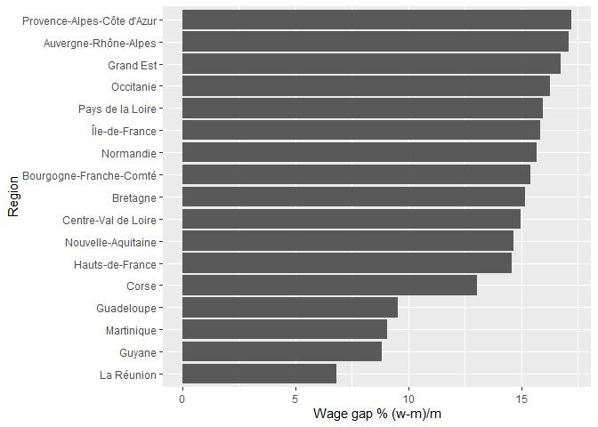<!-- -->

```r
rm(q1)
```
**Was the wage gap women and men the highest in Metropolitan or Overseas French departments (DOM) on average in 2017?**

**Answer:**  It was highest in Metropolitan France on average, men earning approximately 15.6% more on average than women, vs an approcimately 8.6% difference for French overseas regions. 


```r
q2 <- nmdsData %>% 
  select(geographic_region_group, pct_wage_gap) %>% 
  group_by(geographic_region_group) %>% 
  summarise(pct_wage_gap = mean(pct_wage_gap)) %>% 
  arrange(desc(pct_wage_gap))

q2
```

<div data-pagedtable="false">
  <script data-pagedtable-source type="application/json">
{"columns":[{"label":["geographic_region_group"],"name":[1],"type":["chr"],"align":["left"]},{"label":["pct_wage_gap"],"name":[2],"type":["dbl"],"align":["right"]}],"data":[{"1":"Metropolitan France","2":"15.58692"},{"1":"DOM","2":"8.55500"}],"options":{"columns":{"min":{},"max":[10]},"rows":{"min":[10],"max":[10]},"pages":{}}}
  </script>
</div>

```r
q2 %>% 
  ggplot(aes(x=geographic_region_group, y=pct_wage_gap)) + 
  geom_col() +
  labs(x="Region", y="Wage gap % (w-m)/m")
```

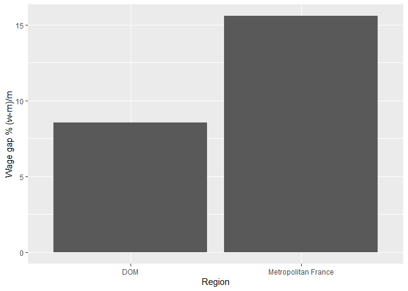<!-- -->

```r
rm(q2)
```

**Which regions had the highest rates and intensities of poverty combined in 2017?**

**Answer:** The regions with the highest combined rates of poverty and intensities of poverty are the DOM regions of French Guiana, Reunion island, Guadeloupe, and Martinique island. See the table below for a ranking of other regions by monetary poverty and intensity of poverty.


```r
nmdsData %>% 
  select(region, monetary_poverty, poverty_intensity) %>% 
  arrange(desc(monetary_poverty), desc(poverty_intensity))
```

<div data-pagedtable="false">
  <script data-pagedtable-source type="application/json">
{"columns":[{"label":["region"],"name":[1],"type":["chr"],"align":["left"]},{"label":["monetary_poverty"],"name":[2],"type":["dbl"],"align":["right"]},{"label":["poverty_intensity"],"name":[3],"type":["dbl"],"align":["right"]}],"data":[{"1":"Guyane","2":"52.9","3":"40.4"},{"1":"La Réunion","2":"38.3","3":"23.3"},{"1":"Guadeloupe","2":"34.5","3":"24.8"},{"1":"Martinique","2":"28.6","3":"23.5"},{"1":"Corse","2":"18.7","3":"21.5"},{"1":"Hauts-de-France","2":"17.9","3":"18.8"},{"1":"Provence-Alpes-Côte d'Azur","2":"17.0","3":"21.4"},{"1":"Occitanie","2":"16.8","3":"20.4"},{"1":"Île-de-France","2":"15.3","3":"22.4"},{"1":"Grand Est","2":"14.5","3":"19.6"},{"1":"Nouvelle-Aquitaine","2":"13.5","3":"19.3"},{"1":"Normandie","2":"13.4","3":"18.7"},{"1":"Centre-Val de Loire","2":"13.2","3":"19.5"},{"1":"Bourgogne-Franche-Comté","2":"12.8","3":"18.4"},{"1":"Auvergne-Rhône-Alpes","2":"12.5","3":"19.5"},{"1":"Bretagne","2":"10.9","3":"18.2"},{"1":"Pays de la Loire","2":"10.8","3":"17.9"}],"options":{"columns":{"min":{},"max":[10]},"rows":{"min":[10],"max":[10]},"pages":{}}}
  </script>
</div>

**Which region had the lowest age at first child gap between women and men in 2019**

**Answer:** The region which had the lowest age at first child gap between women and men in 2019 was Brittany, on the west coast of France (it's my home region). 


```r
nmdsData %>% 
  select(region, age_first_child_gap_y) %>% 
  arrange(age_first_child_gap_y) %>% 
  head(1)
```

<div data-pagedtable="false">
  <script data-pagedtable-source type="application/json">
{"columns":[{"label":[""],"name":["_rn_"],"type":[""],"align":["left"]},{"label":["region"],"name":[1],"type":["chr"],"align":["left"]},{"label":["age_first_child_gap_y"],"name":[2],"type":["dbl"],"align":["right"]}],"data":[{"1":"Bretagne","2":"2.4","_rn_":"1"}],"options":{"columns":{"min":{},"max":[10]},"rows":{"min":[10],"max":[10]},"pages":{}}}
  </script>
</div>

# Analysis:

Okay, enough playing around, let's conduct some tests!!!

**Research question 1:** Is there a difference in the recorded wage gap between women and men in different age groups in 2017 between metropolitan France and the DOM?

- Two way ANOVA 
  * IVs = regions, age group 
  * DV = wage gap %
- Post Hoc test on the results
- Result reporting and analysis.

Null hypotheses:
$H_{0_1}$: there is no main effect of geographic region group
$H_{0_2}$: there is no main effect of age group
$H_{0_3}$: there is no interaction between geographic region group and age group

Base data frame: `pct_wage_gap_wm_age`

**Visualisation and testing:**


```r
# conduct ANOVA (doing this first makes it really convenient to check that ANOVA assumptions are met)
aov1 <- aov(wage_gap_pct~geographic_region_group*age_group, data=pct_wage_gap_wm_age)
summary(aov1)
```

```
##                                   Df Sum Sq Mean Sq F value  Pr(>F)    
## geographic_region_group            1  501.7   501.7 260.023 < 2e-16 ***
## age_group                          2 2350.2  1175.1 609.073 < 2e-16 ***
## geographic_region_group:age_group  2   22.1    11.0   5.717 0.00613 ** 
## Residuals                         45   86.8     1.9                    
## ---
## Signif. codes:  0 '***' 0.001 '**' 0.01 '*' 0.05 '.' 0.1 ' ' 1
```

```r
# conduct a Tukey HSD post-hoc test (we only care about the interaction because it is significant)
tidy(TukeyHSD(aov1)) %>% 
  filter(term == "geographic_region_group:age_group") %>% 
  arrange(adj.p.value)
```

<div data-pagedtable="false">
  <script data-pagedtable-source type="application/json">
{"columns":[{"label":["term"],"name":[1],"type":["chr"],"align":["left"]},{"label":["contrast"],"name":[2],"type":["chr"],"align":["left"]},{"label":["null.value"],"name":[3],"type":["dbl"],"align":["right"]},{"label":["estimate"],"name":[4],"type":["dbl"],"align":["right"]},{"label":["conf.low"],"name":[5],"type":["dbl"],"align":["right"]},{"label":["conf.high"],"name":[6],"type":["dbl"],"align":["right"]},{"label":["adj.p.value"],"name":[7],"type":["dbl"],"align":["right"]}],"data":[{"1":"geographic_region_group:age_group","2":"Metropolitan France:more than 50-DOM:25 and lower","3":"0","4":"-23.1076923","5":"-25.471169","6":"-20.744215","7":"2.403633e-13"},{"1":"geographic_region_group:age_group","2":"Metropolitan France:more than 50-Metropolitan France:25 and lower","3":"0","4":"-17.4446154","5":"-19.065947","6":"-15.823284","7":"2.403633e-13"},{"1":"geographic_region_group:age_group","2":"Metropolitan France:more than 50-DOM:26 to 50","3":"0","4":"-17.2276923","5":"-19.591169","6":"-14.864215","7":"2.403633e-13"},{"1":"geographic_region_group:age_group","2":"Metropolitan France:more than 50-Metropolitan France:26 to 50","3":"0","4":"-10.1346154","5":"-11.755947","6":"-8.513284","7":"2.403633e-13"},{"1":"geographic_region_group:age_group","2":"Metropolitan France:26 to 50-DOM:25 and lower","3":"0","4":"-12.9730769","5":"-15.336554","6":"-10.609600","7":"2.404743e-13"},{"1":"geographic_region_group:age_group","2":"DOM:more than 50-DOM:25 and lower","3":"0","4":"-13.6825000","5":"-16.605397","6":"-10.759603","7":"2.419176e-13"},{"1":"geographic_region_group:age_group","2":"Metropolitan France:26 to 50-Metropolitan France:25 and lower","3":"0","4":"-7.3100000","5":"-8.931332","6":"-5.688668","7":"2.435829e-13"},{"1":"geographic_region_group:age_group","2":"Metropolitan France:more than 50-DOM:more than 50","3":"0","4":"-9.4251923","5":"-11.788669","6":"-7.061715","7":"2.846612e-13"},{"1":"geographic_region_group:age_group","2":"DOM:more than 50-Metropolitan France:25 and lower","3":"0","4":"-8.0194231","5":"-10.382900","6":"-5.655946","7":"5.996648e-12"},{"1":"geographic_region_group:age_group","2":"Metropolitan France:26 to 50-DOM:26 to 50","3":"0","4":"-7.0930769","5":"-9.456554","6":"-4.729600","7":"2.355375e-10"},{"1":"geographic_region_group:age_group","2":"DOM:more than 50-DOM:26 to 50","3":"0","4":"-7.8025000","5":"-10.725397","6":"-4.879603","7":"6.141262e-09"},{"1":"geographic_region_group:age_group","2":"Metropolitan France:25 and lower-DOM:25 and lower","3":"0","4":"-5.6630769","5":"-8.026554","6":"-3.299600","7":"9.577854e-08"},{"1":"geographic_region_group:age_group","2":"DOM:26 to 50-DOM:25 and lower","3":"0","4":"-5.8800000","5":"-8.802897","6":"-2.957103","7":"4.711172e-06"},{"1":"geographic_region_group:age_group","2":"DOM:more than 50-Metropolitan France:26 to 50","3":"0","4":"-0.7094231","5":"-3.072900","6":"1.654054","7":"9.461690e-01"},{"1":"geographic_region_group:age_group","2":"DOM:26 to 50-Metropolitan France:25 and lower","3":"0","4":"-0.2169231","5":"-2.580400","6":"2.146554","7":"9.997795e-01"}],"options":{"columns":{"min":{},"max":[10]},"rows":{"min":[10],"max":[10]},"pages":{}}}
  </script>
</div>


```r
# retroactively check assumptions of ANOVA are met:

# homogeneity of variance
plot(aov1, 1) # points 51, 1, and 49 are detected as outliers and could be messing with our results, but I don't really know where to start to find them in the original data set, so I cannot (and should not, since I don't know what they are) remove them
```

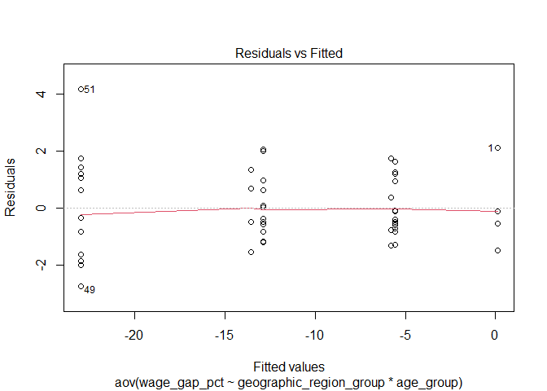<!-- -->

```r
# normality
plot(aov1, 2)
```

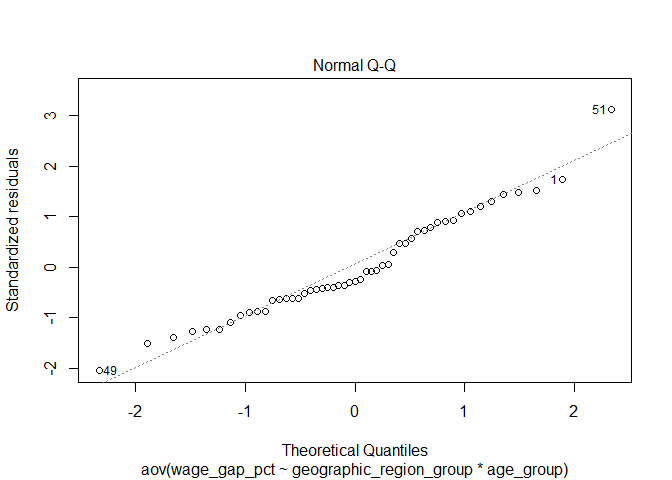<!-- -->


```r
# plot distribution of wage gap percentages between women and men in France
hist_1 <- pct_wage_gap_wm_age %>% 
  ggplot(aes(x=wage_gap_pct)) +
  geom_histogram(binwidth = 1) + 
  labs(title="Distribution of net wage gaps \nbetween women and men in France by age", x="Wage gap w-m (%)", y="Frequency", caption="Source: INSEE")

# plot box plot of data frame: 
boxplot_1 <- pct_wage_gap_wm_age %>% 
  ggplot(aes(x=age_group, y=wage_gap_pct, colour=geographic_region_group)) +
  geom_point(position = position_jitterdodge()) +
  geom_boxplot(fill=NA) + 
  labs(title="Wage gaps between women and men \nby age groups and geographic region", x="Age group", y="Wage gap w-m (%)", colour="Geographic region", caption = "Source: INSEE")

# plot interaction plot of variables
interaction_plot_1 <- pct_wage_gap_wm_age %>% 
  group_by(age_group, geographic_region_group) %>% 
  summarise(means = mean(wage_gap_pct)) %>% 
  ggplot(aes(geographic_region_group, means)) +
  geom_line(size = 1.2, aes(group = age_group, color = age_group)) +
  geom_point(size = 2.6, aes(color = age_group), shape = 15) +
  labs(title="Interaction plot of Age groups \nand geographic region groups", x="Geographic region", y="Mean wage gap w-m (%)" , colour="Age", caption="Source: INSEE")
```

```
## `summarise()` has grouped output by 'age_group'. You can override using the `.groups` argument.
```

```r
# reveal plots
hist_1
```

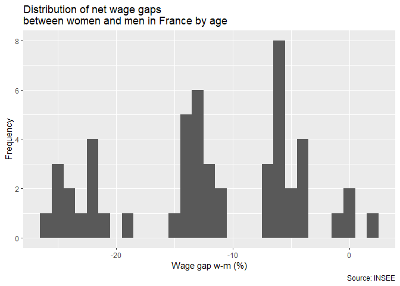<!-- -->

```r
boxplot_1
```

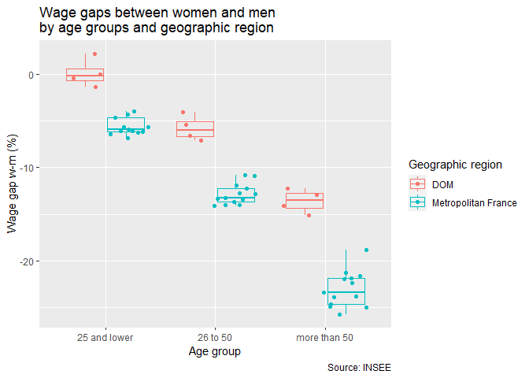<!-- -->

```r
interaction_plot_1
```

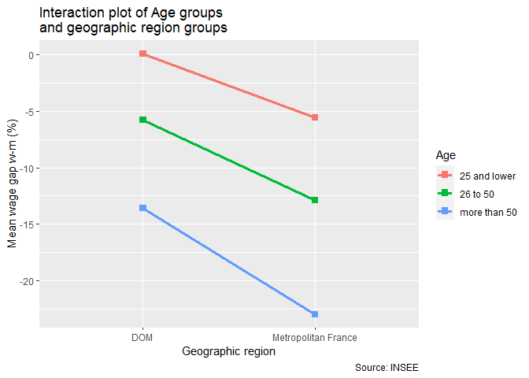<!-- -->

```r
# report results (see below):
```

**Results:**

> A two-way ANOVA (table above) revealed a significant effect of geographic region (P < 0.01) and age group (P < 0.01) on wage gap % between women and men, but with a significant interaction between geographic region and age group (P < 0.01). Observations in age group age>50 in Metropolitan France yielded higher wage gap results than expected when compared to the values found in other age group observations. We can reject $H_{0_3}$, but require further research in order to support or reject $H_{0_1}$ and $H_{0_2}$

**Research question 2:** Is there a difference in the recorded wage gap between women and men in different socioprofessional groups in 2017 between metropolitan France and the DOM?

- Two way ANOVA
  * IVs = regions, socioprofessional group, 
  * DV = wage gap %
- Post Hoc test on the results
- Result reporting and analysis.

Null hypotheses:
$H_{0_1}$: there is no main effect of geographic region group
$H_{0_2}$: there is no main effect of socioprofessional designation group
$H_{0_3}$: there is no interaction between geographic region group and socioprofessional designation group

[Socioprofessional group nomenclature (INSEE, 2013)](https://www.insee.fr/fr/metadonnees/pcs2003/categorieSocioprofessionnelleAgregee/1?champRecherche=true)

Base data frame: `taux.ecarts.salaires.fh.soc`

**Visualisation and testing:**


```r
# conduct ANOVA
aov2 <- aov(wage_gap_pct~geographic_region_group*socioprofessional_group, data=pct_wage_gap_wm_soc)
summary(aov2)
```

```
##                                                 Df Sum Sq Mean Sq F value
## geographic_region_group                          1    3.7     3.7   1.176
## socioprofessional_group                          3 1585.2   528.4 169.760
## geographic_region_group:socioprofessional_group  3   75.4    25.1   8.079
## Residuals                                       60  186.8     3.1        
##                                                   Pr(>F)    
## geographic_region_group                         0.282469    
## socioprofessional_group                          < 2e-16 ***
## geographic_region_group:socioprofessional_group 0.000132 ***
## Residuals                                                   
## ---
## Signif. codes:  0 '***' 0.001 '**' 0.01 '*' 0.05 '.' 0.1 ' ' 1
```

```r
# conduct a Tukey HSD post-hoc test (we only care about the interaction because it is significant)
tidy(TukeyHSD(aov2)) %>% 
  filter(term == "geographic_region_group:socioprofessional_group") %>% 
  arrange(adj.p.value)
```

<div data-pagedtable="false">
  <script data-pagedtable-source type="application/json">
{"columns":[{"label":["term"],"name":[1],"type":["chr"],"align":["left"]},{"label":["contrast"],"name":[2],"type":["chr"],"align":["left"]},{"label":["null.value"],"name":[3],"type":["dbl"],"align":["right"]},{"label":["estimate"],"name":[4],"type":["dbl"],"align":["right"]},{"label":["conf.low"],"name":[5],"type":["dbl"],"align":["right"]},{"label":["conf.high"],"name":[6],"type":["dbl"],"align":["right"]},{"label":["adj.p.value"],"name":[7],"type":["dbl"],"align":["right"]}],"data":[{"1":"geographic_region_group:socioprofessional_group","2":"Metropolitan France:executives-DOM:employees","3":"0","4":"-15.55846154","5":"-18.72631522","6":"-12.3906079","7":"1.988842e-11"},{"1":"geographic_region_group:socioprofessional_group","2":"Metropolitan France:executives-Metropolitan France:employees","3":"0","4":"-13.03461538","5":"-15.20774508","6":"-10.8614857","7":"1.988842e-11"},{"1":"geographic_region_group:socioprofessional_group","2":"DOM:executives-Metropolitan France:employees","3":"0","4":"-13.08115385","5":"-16.24900753","6":"-9.9133002","7":"1.989287e-11"},{"1":"geographic_region_group:socioprofessional_group","2":"DOM:executives-DOM:employees","3":"0","4":"-15.60500000","5":"-19.52266528","6":"-11.6873347","7":"1.989708e-11"},{"1":"geographic_region_group:socioprofessional_group","2":"Metropolitan France:workers-Metropolitan France:executives","3":"0","4":"7.30384615","5":"5.13071646","6":"9.4769759","7":"2.001455e-11"},{"1":"geographic_region_group:socioprofessional_group","2":"Metropolitan France:intermediary positions-Metropolitan France:employees","3":"0","4":"-6.52230769","5":"-8.69543739","6":"-4.3491780","7":"2.529921e-11"},{"1":"geographic_region_group:socioprofessional_group","2":"Metropolitan France:intermediary positions-Metropolitan France:executives","3":"0","4":"6.51230769","5":"4.33917800","6":"8.6854374","7":"2.560474e-11"},{"1":"geographic_region_group:socioprofessional_group","2":"DOM:intermediary positions-Metropolitan France:executives","3":"0","4":"9.48596154","5":"6.31810786","6":"12.6538152","7":"2.576195e-11"},{"1":"geographic_region_group:socioprofessional_group","2":"DOM:workers-DOM:employees","3":"0","4":"-11.51750000","5":"-15.43516528","6":"-7.5998347","7":"3.117262e-11"},{"1":"geographic_region_group:socioprofessional_group","2":"Metropolitan France:intermediary positions-DOM:employees","3":"0","4":"-9.04615385","5":"-12.21400753","6":"-5.8783002","7":"5.112766e-11"},{"1":"geographic_region_group:socioprofessional_group","2":"DOM:workers-Metropolitan France:employees","3":"0","4":"-8.99365385","5":"-12.16150753","6":"-5.8258002","7":"5.809231e-11"},{"1":"geographic_region_group:socioprofessional_group","2":"Metropolitan France:workers-Metropolitan France:employees","3":"0","4":"-5.73076923","5":"-7.90389893","6":"-3.5576395","7":"4.712281e-10"},{"1":"geographic_region_group:socioprofessional_group","2":"Metropolitan France:workers-DOM:employees","3":"0","4":"-8.25461538","5":"-11.42246907","6":"-5.0867617","7":"6.835222e-10"},{"1":"geographic_region_group:socioprofessional_group","2":"DOM:intermediary positions-DOM:executives","3":"0","4":"9.53250000","5":"5.61483472","6":"13.4501653","7":"5.581484e-09"},{"1":"geographic_region_group:socioprofessional_group","2":"Metropolitan France:workers-DOM:executives","3":"0","4":"7.35038462","5":"4.18253093","6":"10.5182383","7":"2.240255e-08"},{"1":"geographic_region_group:socioprofessional_group","2":"Metropolitan France:intermediary positions-DOM:executives","3":"0","4":"6.55884615","5":"3.39099247","6":"9.7266998","7":"4.803686e-07"},{"1":"geographic_region_group:socioprofessional_group","2":"DOM:intermediary positions-DOM:employees","3":"0","4":"-6.07250000","5":"-9.99016528","6":"-2.1548347","7":"2.201879e-04"},{"1":"geographic_region_group:socioprofessional_group","2":"DOM:workers-DOM:intermediary positions","3":"0","4":"-5.44500000","5":"-9.36266528","6":"-1.5273347","7":"1.254266e-03"},{"1":"geographic_region_group:socioprofessional_group","2":"DOM:workers-Metropolitan France:executives","3":"0","4":"4.04096154","5":"0.87310786","6":"7.2088152","7":"4.054206e-03"},{"1":"geographic_region_group:socioprofessional_group","2":"DOM:intermediary positions-Metropolitan France:employees","3":"0","4":"-3.54865385","5":"-6.71650753","6":"-0.3808002","7":"1.781540e-02"},{"1":"geographic_region_group:socioprofessional_group","2":"DOM:workers-DOM:executives","3":"0","4":"4.08750000","5":"0.16983472","6":"8.0051653","7":"3.490696e-02"},{"1":"geographic_region_group:socioprofessional_group","2":"Metropolitan France:workers-DOM:workers","3":"0","4":"3.26288462","5":"0.09503093","6":"6.4307383","7":"3.905535e-02"},{"1":"geographic_region_group:socioprofessional_group","2":"Metropolitan France:intermediary positions-DOM:intermediary positions","3":"0","4":"-2.97365385","5":"-6.14150753","6":"0.1941998","7":"8.088631e-02"},{"1":"geographic_region_group:socioprofessional_group","2":"Metropolitan France:employees-DOM:employees","3":"0","4":"-2.52384615","5":"-5.69169983","6":"0.6440075","7":"2.146516e-01"},{"1":"geographic_region_group:socioprofessional_group","2":"DOM:workers-Metropolitan France:intermediary positions","3":"0","4":"-2.47134615","5":"-5.63919983","6":"0.6965075","7":"2.372180e-01"},{"1":"geographic_region_group:socioprofessional_group","2":"Metropolitan France:workers-DOM:intermediary positions","3":"0","4":"-2.18211538","5":"-5.34996907","6":"0.9857383","7":"3.882282e-01"},{"1":"geographic_region_group:socioprofessional_group","2":"Metropolitan France:workers-Metropolitan France:intermediary positions","3":"0","4":"0.79153846","5":"-1.38159124","6":"2.9646682","7":"9.441114e-01"},{"1":"geographic_region_group:socioprofessional_group","2":"Metropolitan France:executives-DOM:executives","3":"0","4":"0.04653846","5":"-3.12131522","6":"3.2143921","7":"1.000000e+00"}],"options":{"columns":{"min":{},"max":[10]},"rows":{"min":[10],"max":[10]},"pages":{}}}
  </script>
</div>


```r
# retroactively check assumptions of ANOVA are met:

# homogeneity of variance
plot(aov2, 1) # points 22, 20, and 39 are detected as outliers and could be messing with our results, but I don't really know where to start to find them in the original data set, so I cannot (and should not, since I don't know what they are) remove them
```

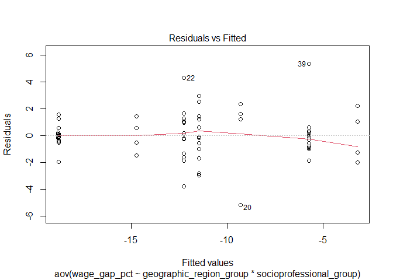<!-- -->

```r
# normality
plot(aov2, 2)
```

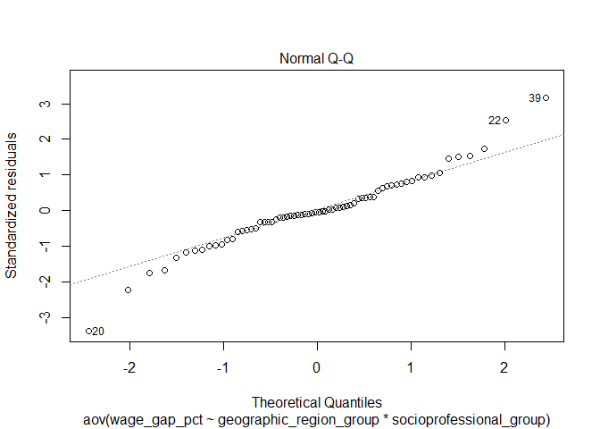<!-- -->


```r
# plot distribution of wage gap percentages between women and men in France
hist_2 <- pct_wage_gap_wm_soc %>% 
  ggplot(aes(x=wage_gap_pct)) +
  geom_histogram(binwidth = 1) + 
  labs(title="Distribution of net wage gap \nbetween women and men in France by socioprofessional designation", x="Wage gap w-m (%)", y="Frequency", caption="Source: INSEE")

# sort data frame to display ordered x-axis on boxplot
pct_wage_gap_wm_soc$socioprofessional_group <- factor(pct_wage_gap_wm_soc$socioprofessional_group, levels=c("executives" , "intermediary positions", "employees", "workers"))
pct_wage_gap_wm_soc$geographic_region_group <- factor(pct_wage_gap_wm_soc$geographic_region_group, levels=c("Metropolitan France", "DOM"))

# plot box plot of data frame: 
boxplot_2 <- pct_wage_gap_wm_soc %>% 
  ggplot(aes(x=socioprofessional_group, y=wage_gap_pct, colour=geographic_region_group)) +
  geom_point(position = position_jitterdodge()) +
  geom_boxplot(fill=NA) + 
  labs(title="Wage gap between women and men \nby socioprofessional designation and geographic region", x="Socioprofessional designation", y="Wage gap w-m (%)", colour="Geographic region", caption = "Source: INSEE")

# add boxplot for executives because it is too small to visualise in the shared boxplot
boxplot_3 <- pct_wage_gap_wm_soc %>% 
  filter(socioprofessional_group == "executives") %>% 
  ggplot(aes(x=socioprofessional_group, y=wage_gap_pct, colour=geographic_region_group)) +
  geom_point(position = position_jitterdodge()) +
  geom_boxplot(fill=NA) +
  labs(title="Wage gap between women and men who are \nexecutives by geographic region", x="Socioprofessional designation", y="Wage gap w-m (%)", colour="Geographic region", caption="Source: INSEE")

# plot interaction plot of variables

interaction_plot_2 <- pct_wage_gap_wm_soc %>% 
  group_by(socioprofessional_group, geographic_region_group) %>% 
  summarise(means = mean(wage_gap_pct)) %>% 
  ggplot(aes(geographic_region_group, means)) +
  geom_line(size = 1.2, aes(group = socioprofessional_group, color = socioprofessional_group)) +
  geom_point(size = 2.6, aes(color = socioprofessional_group), shape = 15) +
  labs(title="Interaction plot of Socioprofessional groups \nand geographic region groups", x="Geographic region", y="Mean wage gap w-m (%)" , colour="Age", caption="Source: INSEE")
```

```
## `summarise()` has grouped output by 'socioprofessional_group'. You can override using the `.groups` argument.
```

```r
# reveal plots
hist_2
```

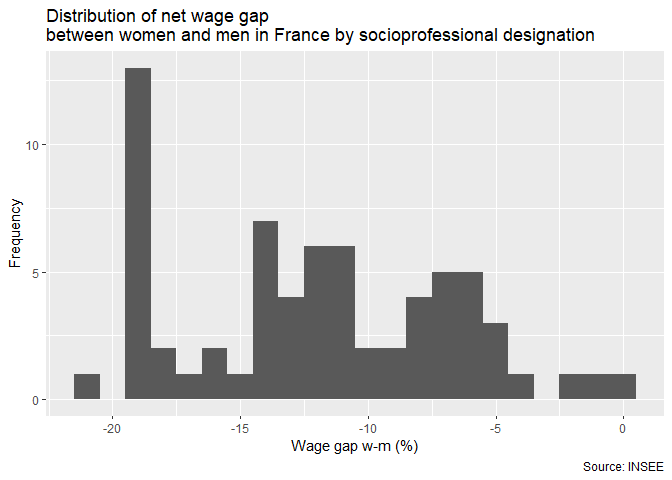<!-- -->

```r
boxplot_2
```

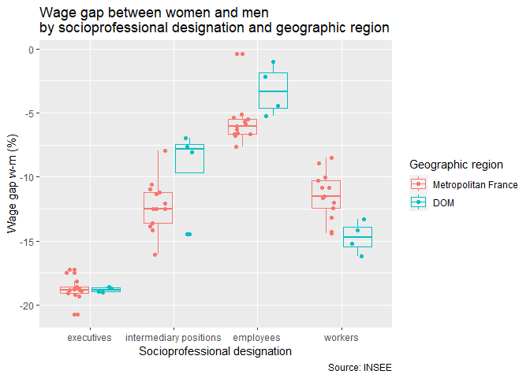<!-- -->

```r
boxplot_3
```

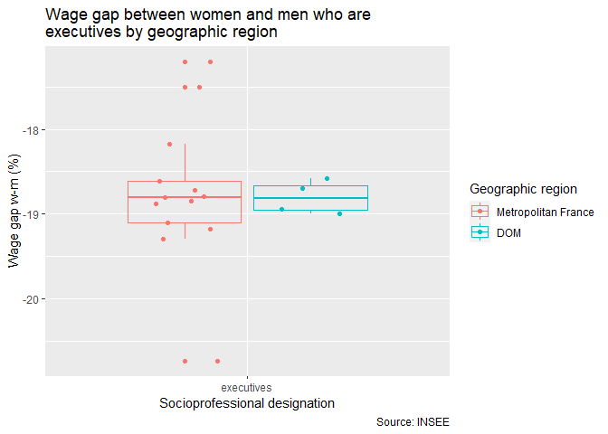<!-- -->

```r
interaction_plot_2
```

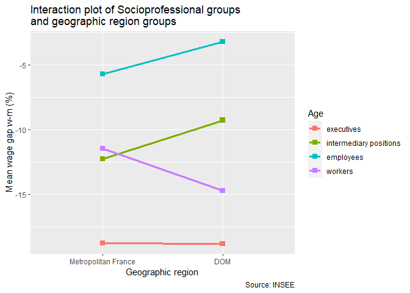<!-- -->

```r
# report results (see below)
```

### Results:

>A two-way ANOVA (table above) revealed a significant effect of socioprofessional group (P < 0.01) but not geographic region (P = 0.28) on wage gap % between women and men, but with a significant interaction between geographic region and socioprofessional group (P < 0.01). In Metropolitan France, observations of workers showed yielded lower wage gap values when compared to DOM observations, for employees and intermediary positions the effect was reversed." We can reject $H_{0_3}$, but require further research in order to support or reject $H_{0_1}$ and $H_{0_2}$

# Test 3: Non-Metric Multidimensional Scaling (NMDS) ordination:

Okay, you caught me, this isn't really a statistical test, its an ordination, but it felt much too important and complicated to put in the data exploration section of this document, so I'm sure you'll understand my decision to put it here. 

NMDS is an approach to ordination which uses an iterative approach to avoid making any assumptions of linearity of relationships between variables and observations in the data. It produces an ordination space in n-dimensions by maximising the Spearman's rank correlation (which is the nonparametric equivalent to Pearson's R) between the distances in the starting - real world - observations and variables, and the observations in ordination space.^[(Matthew E. Clapham 2016)]

In this NMDS, I'll be using geographic region groups as different observations, and rates (%) of total monetary poverty, intensity of poverty, net wage gap (absolute values), total employemt rate gap in official municipality poistions (%), and number of years gap between average ages at fist chile for women and men (y)] as variable vectors (bubbles would be metropolitan France and the DOM).

While I'm at it, here's an excellent resource to understand NMDS: [good NMDS resource](https://www.youtube.com/watch?v=Kl49qI3XJKY)


```r
# data sets to use (variables cols ~ region rows):
# - total wage gap % ((w-m)*-1) <- important
# - total monetary poverty %
# - total intensity of poverty %
# - total employment rate gap in official municipal positions % ((w-m)*-1)
# - n year gap between average ages at first child for women and men (y) ((w-m)*-1)  

# multiplications by -1 made so that higher values are equated to larger imbalances disfavouring women. 

nmdsData
```

<div data-pagedtable="false">
  <script data-pagedtable-source type="application/json">
{"columns":[{"label":["region"],"name":[1],"type":["chr"],"align":["left"]},{"label":["pct_wage_gap"],"name":[2],"type":["dbl"],"align":["right"]},{"label":["monetary_poverty"],"name":[3],"type":["dbl"],"align":["right"]},{"label":["poverty_intensity"],"name":[4],"type":["dbl"],"align":["right"]},{"label":["ofc_employment_gap"],"name":[5],"type":["dbl"],"align":["right"]},{"label":["age_first_child_gap_y"],"name":[6],"type":["dbl"],"align":["right"]},{"label":["geographic_region_group"],"name":[7],"type":["chr"],"align":["left"]}],"data":[{"1":"Guadeloupe","2":"9.52","3":"34.5","4":"24.8","5":"-0.2","6":"3.7","7":"DOM"},{"1":"Martinique","2":"9.08","3":"28.6","4":"23.5","5":"2.0","6":"3.6","7":"DOM"},{"1":"Guyane","2":"8.81","3":"52.9","4":"40.4","5":"3.4","6":"4.5","7":"DOM"},{"1":"La Réunion","2":"6.81","3":"38.3","4":"23.3","5":"0.4","6":"3.3","7":"DOM"},{"1":"Île-de-France","2":"15.85","3":"15.3","4":"22.4","5":"3.8","6":"3.5","7":"Metropolitan France"},{"1":"Centre-Val de Loire","2":"14.97","3":"13.2","4":"19.5","5":"10.4","6":"2.8","7":"Metropolitan France"},{"1":"Bourgogne-Franche-Comté","2":"15.39","3":"12.8","4":"18.4","5":"19.0","6":"2.8","7":"Metropolitan France"},{"1":"Normandie","2":"15.68","3":"13.4","4":"18.7","5":"12.2","6":"2.7","7":"Metropolitan France"},{"1":"Hauts-de-France","2":"14.58","3":"17.9","4":"18.8","5":"15.0","6":"2.8","7":"Metropolitan France"},{"1":"Grand Est","2":"16.74","3":"14.5","4":"19.6","5":"19.4","6":"2.9","7":"Metropolitan France"},{"1":"Pays de la Loire","2":"15.96","3":"10.8","4":"17.9","5":"4.4","6":"2.5","7":"Metropolitan France"},{"1":"Bretagne","2":"15.17","3":"10.9","4":"18.2","5":"3.4","6":"2.4","7":"Metropolitan France"},{"1":"Nouvelle-Aquitaine","2":"14.65","3":"13.5","4":"19.3","5":"10.2","6":"2.7","7":"Metropolitan France"},{"1":"Occitanie","2":"16.28","3":"16.8","4":"20.4","5":"12.6","6":"2.9","7":"Metropolitan France"},{"1":"Auvergne-Rhône-Alpes","2":"17.09","3":"12.5","4":"19.5","5":"9.2","6":"2.8","7":"Metropolitan France"},{"1":"Provence-Alpes-Côte d'Azur","2":"17.23","3":"17.0","4":"21.4","5":"7.4","6":"3.2","7":"Metropolitan France"},{"1":"Corse","2":"13.04","3":"18.7","4":"21.5","5":"20.2","6":"3.6","7":"Metropolitan France"}],"options":{"columns":{"min":{},"max":[10]},"rows":{"min":[10],"max":[10]},"pages":{}}}
  </script>
</div>


```r
# convert data frame to matrix (+ maybe assign region names to rows)
nmdsMatrix <- as.matrix(standardize(nmdsData[, 2:6]))
rownames(nmdsMatrix) <- nmdsData$region

# shift minimums so that all values are positive (see http://strata.uga.edu/8370/lecturenotes/multidimensionalScaling.html)
minShift <- function(x) {x + abs(min(x))}
nmdsMatrix <- apply(nmdsMatrix, 2, minShift)

(data.frame(nmdsMatrix))
```

<div data-pagedtable="false">
  <script data-pagedtable-source type="application/json">
{"columns":[{"label":[""],"name":["_rn_"],"type":[""],"align":["left"]},{"label":["pct_wage_gap"],"name":[1],"type":["dbl"],"align":["right"]},{"label":["monetary_poverty"],"name":[2],"type":["dbl"],"align":["right"]},{"label":["poverty_intensity"],"name":[3],"type":["dbl"],"align":["right"]},{"label":["ofc_employment_gap"],"name":[4],"type":["dbl"],"align":["right"]},{"label":["age_first_child_gap_y"],"name":[5],"type":["dbl"],"align":["right"]}],"data":[{"1":"0.8276808","2":"2.027312717","3":"1.31257455","4":"0.0000000","5":"2.4140394","_rn_":"Guadeloupe"},{"1":"0.6932972","2":"1.522623053","3":"1.06527789","4":"0.3285692","5":"2.2283441","_rn_":"Martinique"},{"1":"0.6108346","2":"3.601260143","3":"4.28013439","4":"0.5376588","5":"3.8996021","_rn_":"Guyane"},{"1":"0.0000000","2":"2.352367077","3":"1.02723225","4":"0.0896098","5":"1.6712580","_rn_":"La Réunion"},{"1":"2.7609723","2":"0.384932794","3":"0.85602688","4":"0.5973986","5":"2.0426487","_rn_":"Île-de-France"},{"1":"2.4922050","2":"0.205297490","3":"0.30436511","4":"1.5831064","5":"0.7427814","_rn_":"Centre-Val de Loire"},{"1":"2.6204803","2":"0.171081242","3":"0.09511410","4":"2.8675134","5":"0.7427814","_rn_":"Bourgogne-Franche-Comté"},{"1":"2.7090513","2":"0.222405615","3":"0.15218256","4":"1.8519358","5":"0.5570860","_rn_":"Normandie"},{"1":"2.3730923","2":"0.607338409","3":"0.17120538","4":"2.2701148","5":"0.7427814","_rn_":"Hauts-de-France"},{"1":"3.0327936","2":"0.316500298","3":"0.32338793","4":"2.9272533","5":"0.9284767","_rn_":"Grand Est"},{"1":"2.7945682","2":"0.000000000","3":"0.00000000","4":"0.6870084","5":"0.1856953","_rn_":"Pays de la Loire"},{"1":"2.5532885","2":"0.008554062","3":"0.05706846","4":"0.5376588","5":"0.0000000","_rn_":"Bretagne"},{"1":"2.3944715","2":"0.230959677","3":"0.26631947","4":"1.5532364","5":"0.5570860","_rn_":"Nouvelle-Aquitaine"},{"1":"2.8923017","2":"0.513243726","3":"0.47557049","4":"1.9116756","5":"0.9284767","_rn_":"Occitanie"},{"1":"3.1396897","2":"0.145419056","3":"0.30436511","4":"1.4038868","5":"0.7427814","_rn_":"Auvergne-Rhône-Alpes"},{"1":"3.1824481","2":"0.530351850","3":"0.66579868","4":"1.1350574","5":"1.4855627","_rn_":"Provence-Alpes-Côte d'Azur"},{"1":"1.9027497","2":"0.675770906","3":"0.68482150","4":"3.0467330","5":"2.2283441","_rn_":"Corse"}],"options":{"columns":{"min":{},"max":[10]},"rows":{"min":[10],"max":[10]},"pages":{}}}
  </script>
</div>


```r
# run MDS (also calculates euclidean distance matrix)
my.nmds <- metaMDS(nmdsMatrix, distance='euclidean', k=2, trymax=50)
```

```
## Run 0 stress 0.03434317 
## Run 1 stress 0.03434305 
## ... New best solution
## ... Procrustes: rmse 0.0002253808  max resid 0.0006745908 
## ... Similar to previous best
## Run 2 stress 0.08060092 
## Run 3 stress 0.03434319 
## ... Procrustes: rmse 0.0006556982  max resid 0.001770062 
## ... Similar to previous best
## Run 4 stress 0.03434291 
## ... New best solution
## ... Procrustes: rmse 0.0001129474  max resid 0.000292553 
## ... Similar to previous best
## Run 5 stress 0.03434318 
## ... Procrustes: rmse 0.0001962778  max resid 0.0005382596 
## ... Similar to previous best
## Run 6 stress 0.03434324 
## ... Procrustes: rmse 0.0002305196  max resid 0.000532667 
## ... Similar to previous best
## Run 7 stress 0.03551477 
## Run 8 stress 0.035515 
## Run 9 stress 0.03434317 
## ... Procrustes: rmse 0.0005596339  max resid 0.001484969 
## ... Similar to previous best
## Run 10 stress 0.03551473 
## Run 11 stress 0.03551484 
## Run 12 stress 0.03434302 
## ... Procrustes: rmse 0.0004620656  max resid 0.001232847 
## ... Similar to previous best
## Run 13 stress 0.03551476 
## Run 14 stress 0.03434328 
## ... Procrustes: rmse 0.0002484924  max resid 0.0006470962 
## ... Similar to previous best
## Run 15 stress 0.03434309 
## ... Procrustes: rmse 0.0001409957  max resid 0.0003441488 
## ... Similar to previous best
## Run 16 stress 0.03551479 
## Run 17 stress 0.03434292 
## ... Procrustes: rmse 4.500739e-05  max resid 0.0001367245 
## ... Similar to previous best
## Run 18 stress 0.03434299 
## ... Procrustes: rmse 8.78355e-05  max resid 0.0002031629 
## ... Similar to previous best
## Run 19 stress 0.08060081 
## Run 20 stress 0.0355147 
## *** Solution reached
```

```r
# GOF and Shepards diagram
goodness(my.nmds) # Produces a results of test statistics for goodness of fit for each point
```

```
##  [1] 0.006159621 0.009105688 0.004990403 0.014872112 0.009431411 0.008494026
##  [7] 0.006503835 0.004135235 0.008478204 0.005199827 0.004611126 0.009399121
## [13] 0.009701941 0.004018370 0.006324235 0.012754790 0.008397487
```

```r
stressplot(my.nmds) # Produces a Shepards diagram
```

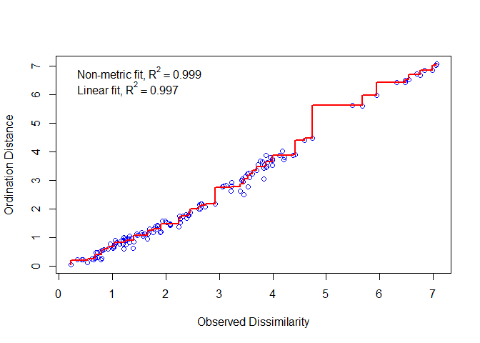<!-- -->

```r
# results
my.nmds
```

```
## 
## Call:
## metaMDS(comm = nmdsMatrix, distance = "euclidean", k = 2, trymax = 50) 
## 
## global Multidimensional Scaling using monoMDS
## 
## Data:     nmdsMatrix 
## Distance: euclidean 
## 
## Dimensions: 2 
## Stress:     0.03434291 
## Stress type 1, weak ties
## Two convergent solutions found after 20 tries
## Scaling: centring, PC rotation 
## Species: expanded scores based on 'nmdsMatrix'
```

```r
# Plotting points in ordination space
plot(my.nmds, "sites", xlim=c(-6,2.5))   # Produces distance 
orditorp(my.nmds, "sites")   # Gives points labels
```

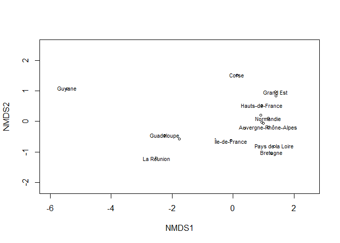<!-- -->

```r
# Variable scores plot
# https://www.burns-stat.com/plot-ranges-of-data-in-r/
# https://rpubs.com/CPEL/nmds

variableScores <- my.nmds$species
sampleScores <- my.nmds$points

DOM3 <- nmdsData$geographic_region_group == "DOM"
metro3 <- nmdsData$geographic_region_group == "Metropolitan France"

# combined data plot

colvec <- c("seagreen", "royalblue")   # Identifies colors for group assignments
pchvec <- c(22, 22)   # Identifies character symbols for group assignments

plot(my.nmds, xlim=c(-6,2.5))
with(nmdsData,
     points(my.nmds,
            display = "sites",
            col = "black",
            pch = pchvec[geographic_region_group],
            bg = colvec[geographic_region_group]))

#Create convex hulls that highlight point clusters based on grouping dataframe
ordihull(
  my.nmds,
  nmdsData$geographic_region_group,
  display = "sites",
  draw = c("polygon"),
  col = NULL,
  border = c("gray0", "gray0", "gray48", "gray48"),
  lty = c(1, 2, 1, 2),
  lwd = 2.5
)

# Calculating and plotting centroids of NMDS Result
scrs <-
  scores(my.nmds, display = "sites", "species")
cent <-
  aggregate(scrs ~ geographic_region_group, data = nmdsData, FUN = "mean")
names(cent) [-1] <- colnames(scrs)
points(cent [,-1],
       pch = c(8, 8),
       col = c("seagreen", "royalblue"),
       bg = c("black"),
       lwd = 3.0,
       cex = 2.0 # Plots centroids as points on ordination
)

# variable scores
text(-3.3, -1, 'DOM', col='seagreen')
text(-.35, -1, 'Metropolitan France', col='royalblue')

arrows(0, 0, variableScores[, 1], variableScores[, 2], length=0.1, angle=20)

textNudge <- 1.2
text(variableScores[, 1]*textNudge, variableScores[, 2]*textNudge, rownames(variableScores), cex=0.7)

# legend
legend("topleft",
       col = c("seagreen", "royalblue"),
       lty = 1,
       legend = c("DOM", "Metropolitan France"),
       cex=0.7)
```

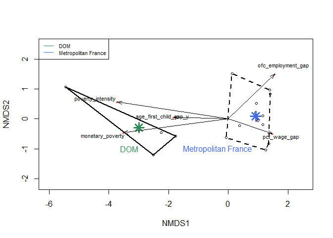<!-- -->

# Bibliography:

