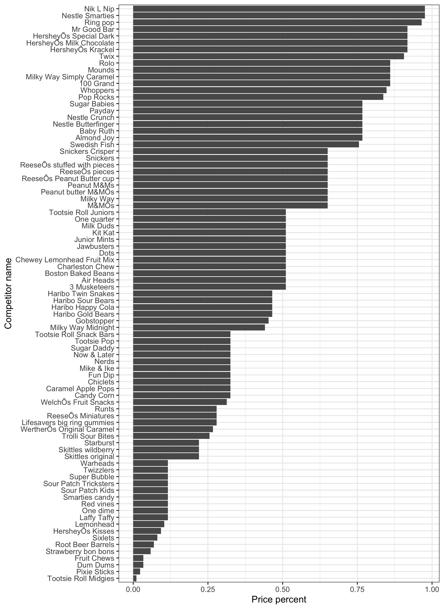

```{r setup, include=FALSE}
knitr::opts_chunk$set(echo = TRUE)
```

# Written Assignment #3

##Details

**Collaboratively worked on with Adel Misherghi** 

- Due Date:
  * 2021-10-29 (this Friday!) prior to the start of class (i.e., needs to be submitted before 1PM EST).
- Format:
  * You’ll submit this via Google Classroom. Again, it can be in whatever format you like so long as it uploads! Take care if you’re trying to use a Google Doc, however, as the copy/paste function of code seems to be a little funky.
- Working Style
  * You can do this individually or as a group - it is entirely up to you! If you do work in groups, please make note in the document that you did so and list everyone’s name.

## Data

In the spirit of the holiday - we’re going to examine some halloween candy data!

The data is available here. You can gather more information about the data set here. You can use the code below to download the data.

```{r}
library(tidyverse)
library(broom)
candy <- read_csv(url("https://raw.githubusercontent.com/kylescotshank/applied_data_science/master/data/candy-data.csv"))
candy
```

Note: for full credit, you must provide the functions you used to obtain your answers!

# Questions

Answer these as thoroughly as you can and please provide the code that you’ve used to generate your answer.

**1.** Generate a facet grid of bar plots showing the distribution of each variable. Your output should show a grid of bar plots where you get a bar for TRUE and FALSE counts of each variable. Note: this will be much, much easier if you remember to use the pivot_longer command). Provide a written interpretation of your visualization.

**Answer:** 

The visualisation is an array of counts of candies all candies in the data set which are or are not of a certain type. (IV = column variable candy attribute, DV = count).

The following visualisation shows that our data set contains:

- 21 candies that are bars, and 64 that are not
- 14 candies that are caramel, and 71 that are not
- 37 candies that are chocolate, and 48 that are not
- 7 candies that are crisped rice wafers, and 78 that are not
- 38 candies that are fruity, and 47 that are not
- 15 candies that are hard, and 70 that are not
- 7 candies that are nougat, and 78 that are not
- 14 candies that are peanuty-almondy, and 71 that are not
- 44 candies that come as one of many in a bag or box, and 41 that do not

```{r}
# prepare the candy data for ggplot
candy_pivoted <- candy %>% 
  select(-c(sugarpercent, pricepercent, winpercent)) %>% 
  pivot_longer(!competitorname, names_to = "property", values_to = "presence") %>% 
  group_by(property, presence) %>% 
  summarise(property_count = n())

# plot a facet wrap of bar plots showing the distribution of each variable (dropping non-logical variables). Here, I chose to generate a facet wrap rather than a facet grid because the facet_wrap allows us to plot across a single variable (ingredient) over multiple rows of the plot, which is easier to read in this case. 
candy_pivoted %>% 
  ggplot() +
  geom_col(aes(as.factor(as.logical(presence)), property_count)) +
  labs(x = "Property presence", y = "Count") +
  facet_wrap(vars(property)) +
  theme_bw()

# This is nice, but we can improve the plot further by replacing the x-axis with a colour-coded legend, since the axis only contains 2 values (TRUE and FALSE), and the colour will more intuitively communicate that information.
candy_pivoted %>%
  ggplot() + 
  geom_col(aes(as.factor(as.logical(presence)), property_count, fill = as.factor(as.logical(presence)))) +
  theme(axis.title.x = element_blank(),
        axis.text.x = element_blank(),
        axis.ticks.x = element_blank()) +
  facet_wrap(vars(property)) +
  labs(y = "Count", fill = 'Presence of property')

```

**2.** Generate a plot where you show competitorname of each candy bar and that candy bar's value for pricepercent. Make sure that this plot has competitorname on the y-axis and the pricepercent on the x-axis. Order the chart so that the values go from largest to smallest (top to bottom). Note: you’ll need to use coord_flip() to do this! Make sure you look up that function with ?coord_flip to see how it works works. You’ll also need to reorder the bars - to do this, use the reorder() function. Use ?reorder to see how it works.

**Answer:** The procedure described above produces the following plot:



```{r, fig.show='hide'}

# Plot a bar graph of competitor name by price percent, and flip it.
candy %>% 
  ggplot() +
  geom_col(aes(x = reorder(competitorname, pricepercent), y = pricepercent)) +
  labs(x = "Competitor name", y = "Price percent") +
  coord_flip() + # This can be skipped by simply swapping the x and y axes variables
  theme_bw()

ggsave("Price_percent_by_competitor_name.png", height = 10)
```

**3.** Run a t-test that compares the average of sugarpercent between candy bars that are chocolate versus those that are not. Report the results and interpret your findings. Visualize the differences between these groups with a boxplot.

**Answer:** 

$H_{0}$: There is no statistically significant difference between the mean sugar percent of candy bars in this data set that are chocolate ($\overline{A}$), and the mean sugar percent of candy bars in this data set that are not chocolate ($\overline{B}$). In consequence: $\overline{A} = \overline{B}$

$H_{1}$: There is a statistically significant difference between the mean sugar percent of candy bars in this data set that are chocolate ($\overline{A}$), and the mean sugar percent of candy bars in this data set that are not chocolate ($\overline{B}$). In consequence: $\overline{A} \neq \overline{B}$

Since the result of a Student's two-tailed T-test shows a T-statistic of approximately 0.99, and a p-value > 0.1 (p = 0.33), we cannot reject $H_{0}$. It is likely that $H_{0}$ is true. (Confidence threshold = 0.95)

```{r}
# filter for candy bars that are chocolate vs those that are not
# candy %>% filter(bar == 1) %>% filter(chocolate == 0)
# I did not do this because it results in too few values to conduct a t-test. I am interpreting the prompt as indifferent as to whether the candy is a bar or not.

# perform t-test
candy %>% 
  do(tidy(t.test(sugarpercent ~ chocolate, data = ., conf.level = 0.95)))

# plot boxplot
candy %>% 
  ggplot(aes(x = as.factor(as.logical(chocolate)), y = sugarpercent)) +
  geom_jitter(alpha = 0.2) + 
  geom_boxplot(fill = NA, color = "coral") + 
  labs(x = "Presence of chocolate", y = "Sugar percent") +
  theme_bw()

```

**4.** Create a scatterplot showing the variable sugarpercent on the x-axis and winpercent on the y-axis. Color the points based on whether or not the candybar is fruity or chocolate. Add linear regressions that show the different relationships for chocolate and fruity candybar types. Provide a written interpretation of your visualization.

**Answer:** 
The regression lines on the first plot show that there is a slight positive linear relation between sugar percent (IV) and win percent (IV) for candies that are fruity or chocolate, and a slight negative linear relation between these two variables for other candies. 

The regression lines on the second plot illustrate the same ideas, but adds that the slight positive linear relation persists for candies that are chocolate, or fruity, when considered individually.

```{r}

# interpreting "Color the points based on whether or not the candybar is fruity or chocolate" as an instruction to colour the points different colours based on whether the candy is fruity or chocolate, or is neither:

candy %>%
  mutate(choc_fruit = if_else(chocolate == 1 | fruity == 1, TRUE, FALSE)) %>% 
  ggplot(aes(x = sugarpercent, y = winpercent, colour = choc_fruit)) +
  geom_point() +
  geom_smooth(method = "lm") +
  labs(x = "Sugar percent", y = "Win percent", colour = "Chocolate or Fruity") +
  theme_bw()

# interpreting "Color the points based on whether or not the candybar is fruity or chocolate" as an instruction to colour the points different colours based on whether the candy is fruity, chocolate, or is neither:


candy %>%
  mutate(choc_fruit = if_else(chocolate == 1, "Chocolate", if_else(fruity == 1, "Fruity", "Other"))) %>% 
  ggplot(aes(x = sugarpercent, y = winpercent, colour = choc_fruit)) +
  geom_point() +
  geom_smooth(method = "lm") +
  labs(x = "Sugar percent", y = "Win percent", colour = "Group") +
  theme_bw()

```

**5.** Run a regression with winpercent as the dependent variable and everything else as independent variables. Print the summary() of the output of this model. Plot all of the coefficients of this model as a bar chart from largest to smallest. Color the bars based on whether or not the coefficients are positive or negative. Hint: you’ll want to use the tidy() function to easily get the coefficients out of your summary to plot them!. Provide a written interpretation of your visualization.

**Answer:** The visualisation of the coefficients of the linear regression of win percent (DV) and all other variables except competitor name (IVs) as a bar chart tells us that pluribus, price percent, and the property of being hard candy negatively linearly relate to win percent for candies in the data set, and that all others positively linearly relate to win percent. 

In other words, candies which are sold in bags of multiple candies, are more expensive, or are hard are less popular, all other variables excluded, while candies with attributes corresponding to other individual variables are more popular, ceteris paribus.  

```{r}

# run a linear regression with winpercent as DV and all other numeric variables as IVs.
lm1 <- lm(winpercent ~ . - winpercent - competitorname, data = candy)
lm1_summary <- tidy(summary(lm1))
lm1_summary

# interpreting "Color the bars based on whether or not the coefficients are positive or negative." as a prompt to colour bars based on the logical attribute "is >= 0", assigning a colour for positive values, and another for negative values:
lm1_summary %>% 
  mutate(is_positive = if_else(estimate >= 0, "Positive", "Negative")) %>% 
  ggplot(aes(x = reorder(term, estimate), y = estimate, fill = is_positive)) +
  geom_col() +
  labs(x = "Estimate", y = "Term", fill = "Group") +
  coord_flip()
```
